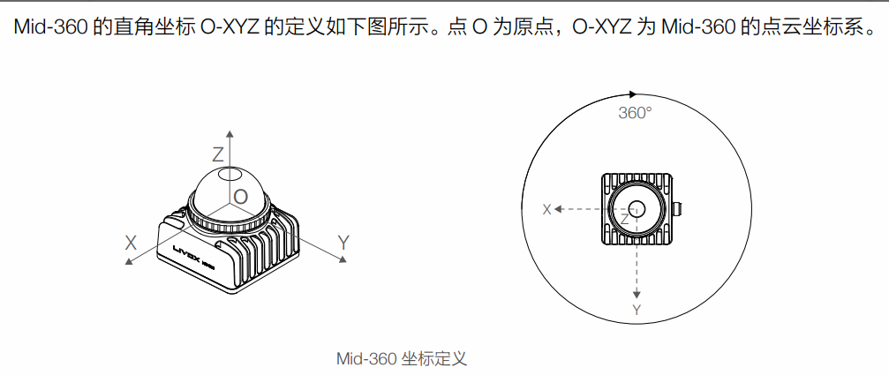
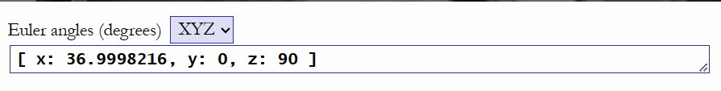
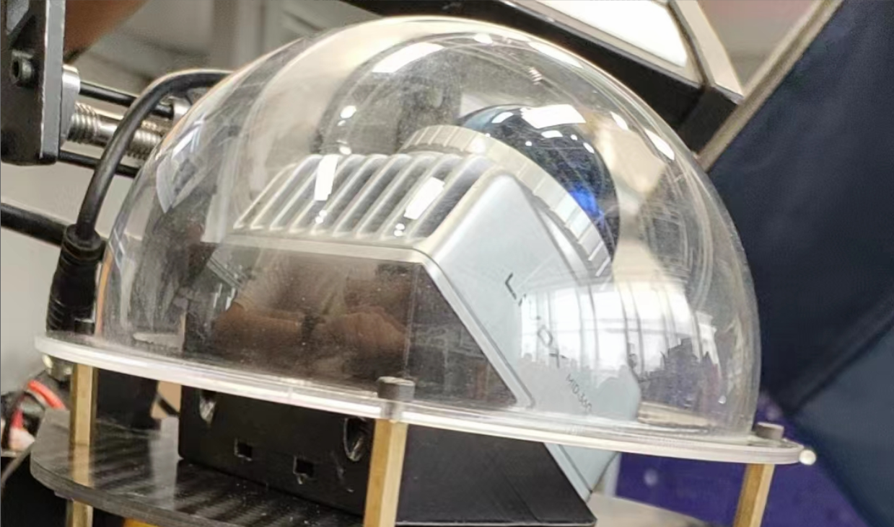

# Point-lio和Fast-lio配置使用

⚠️ 注意，此两种算法都需要静置下启动，否则若未在静置下完成IMU初始化会导致里程计跑飞


Point-lio和Fast-lio的配置使用一般是根据哨兵机器人雷达的安装位置和雷达的数量具体地调整yaml文件

## Point-lio

Point-lio官方库中并无适配mid360的yaml文件（截止到2023.07.08）sentry_ros_3d是根据其中和issue中老哥开源的yaml文件以及Point-lio论文中对参数的解释和参考RM官方开源的Fast-lio配置文件所调整的适配于mid360的yaml文件

需要配置大抵为point-lio→config→mid360.yaml中的如下内容

### 雷达话题配置

```yaml
#若在livox_ros_driver2中配置了多雷达模式（单雷达也可开启多雷达模式）
#则雷达的点云和IMU话题是带雷达IP后缀的，
#若关闭多雷达功能后话题则是/livox/lidar和/livox/imu
lid_topic: "/livox/lidar_192_168_1_3"
imu_topic: "/livox/imu_192_168_1_3"
```

### 里程计性能配置

```yaml
#此配置为是否关闭point-lio对点云的降采样
#若true则为关闭降采样，其发布的里程计频率可达到4w~40whz但是吃性能，上自瞄代码后会出现里程计算不过来的问题
#若false则为打开降采样，其发布的里程计频率会与mid360发布的点云频率同步，若mid360点云频率为10hz则里程计就是10hz
odometry:
    publish_odometry_without_downsample: false
```

### 雷达外参配置

```yaml
#若雷达正装则设置重力的矩阵为[0.0, 0.0, -9.8]反装则设置为[0.0, 0.0, 9.8]
gravity: [0.0, 0.0, -9.800291] 
gravity_init: [0.0, 0.0, -9.810] 
#平移外参，效果不明显，按老哥issue中的设置为[ 0.011, 0.02329, -0.04412]
#但原本的值实测没问题且RM官方给出的Fast-lio的yaml文件中外参也是[-0.011, -0.0234, 0.044]
extrinsic_T: [-0.011, -0.0234, 0.044]
#旋转外参，相当重要！！！！！！
#注释的外参为雷达平放安装且雷达上Livox标签朝前（mid360有一个自身的坐标系定义）时的外参
# extrinsic_R: [  1, 0, 0,
#                 0, 1, 0,
#                 0, 0, 1 ]
#此外参为雷达x方向指向云台的y方向，且前倾37°安装时的外参
#如图2可知此旋转矩阵为按XYZ的欧拉角旋转顺序，雷达在x轴逆时针旋转37度然后在z轴逆时针旋转90°得到的外参
extrinsic_R: [  0, -1, 0,
            0.7986, 0, -0.6018,
            0.6018, 0, 0.7986]
```







⚠️ 注意，point-lio建图保存pcd文件的功能疑似有问题，若需得到保存的稠密点云图，建议使用fast-lio

## Fast-lio

fast-lio的配置文件可配置项不多，但是RM官方（哨兵自动导航资料包）给出对mid360适配的yaml文件有一点问题

```yaml
#官方给出的是450但是通过对比查阅资料和avia的yaml文件以及和slam群老哥交流发现这个是直接抄的avia
#~有问题，这个值的意思是雷达的量程，即雷达点云的有效距离
det_range:     70.0
#外参的配置见Point-lio，一样的
extrinsic_T: [ -0.011, -0.0234, 0.044 ]
extrinsic_R: [  0, -1, 0,
              0.7986, 0, -0.6018,
              0.6018, 0, 0.7986]
pcd_save:
    pcd_save_en: true #若要使用fast-lio保存pcd文件至电脑上，即建立稠密点云图则开启此选项
```

### 修改里程计转发结点的旋转参数

⚠️ 修改了激光雷达里程计（Point-lio&Fast-lio）的外参后需要一并修改里程计转发结点的旋转参数

```YA
float trans_x = -0.185, trans_y = 0.0, trans_z = 0;//平移外参
//旋转外参，和配置文件里面的外参一致即可，将旋转矩阵转为四元数
float rot_w = 0.6705, rot_x = 0.2243, rot_y = -0.2243, rot_z = 0.6705;
```
