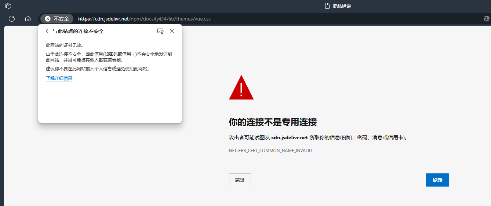

# docsify CDN解析错误问题

最近（2024.5.2）发现docsify的HTTPS证书过期了，导致其需要通过CDN载入的vue文件不被浏览器允许载入，导致进不去笔记本



解决办法则是换一个CDN源，把index.html的这两行换掉就可以了，如果后面还有问题就把它得离线下来了

```html
  <link rel="stylesheet" href="//fastly.jsdelivr.net/npm/docsify@4/lib/themes/vue.css">
  
  <script src="//fastly.jsdelivr.net/npm/docsify@4"></script>
```
