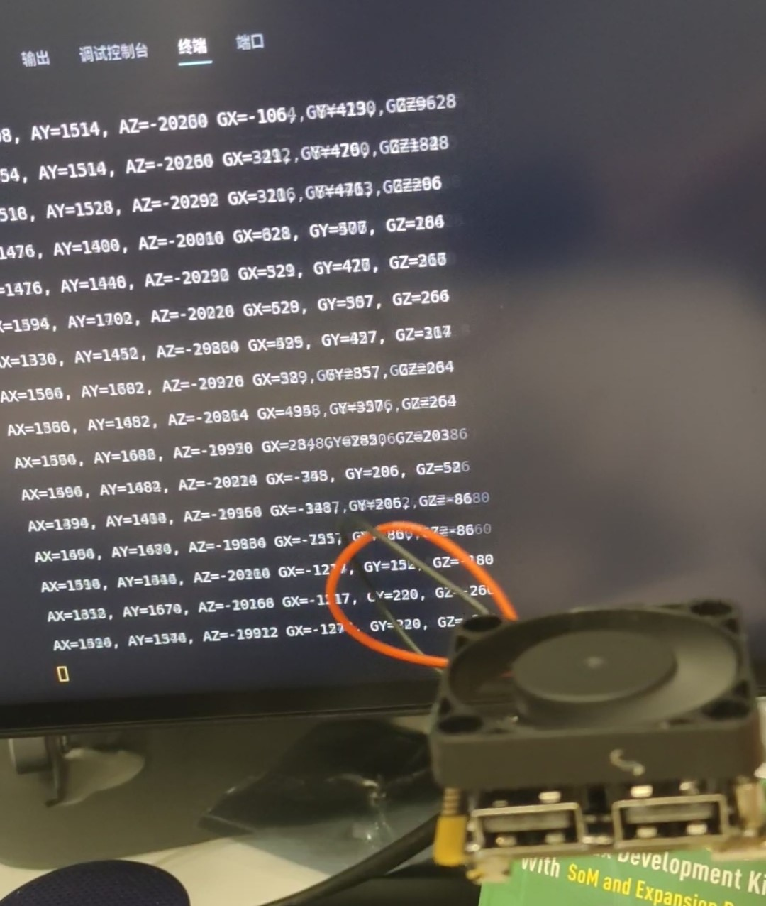

# 嵌入式Linux 第一次驱动移植—quark 陀螺仪驱动

先上效果图



十分感谢这位B站老哥的分享，为我第一次实现驱动移植带来了指路明灯

> [quark-n 使用的内核编译和驱动编译、设备树文件整理 - 哔哩哔哩 (bilibili.com)](https://www.bilibili.com/read/cv20249329/?spm_id_from=333.999.collection.opus.click)

kernel内核、toolchain编译工具链都是从老哥文章中找到的资料，seeed官网的wiki里面资料是真的少，就没指望给你去做驱动开发，只展示了部分应用层的样例，我觉得这也是这款板子不能被大多数人玩起来的原因

废话不多说，正题开始

## 兵马未动，粮草先行—驱动开发，先搞工具链和内核

### 先配置工具链

先从这下toolchain工具链，下载其中  NanoPi-R1S-H3/toolchain/路径下arm-cortexa9-linux-gnueabihf-4.9.3.tar.xz 

> [Building U-boot and Linux for H5/H3/H2+/zh - FriendlyELEC WiKi](https://wiki.friendlyelec.com/wiki/index.php/Building_U-boot_and_Linux_for_H5/H3/H2+/zh)

从b站老哥文章那我也学到了如何去管理自己的工具链库和内核库，因为arm各个芯片都有一套自己的工具链，各个芯片、板子又有自己的linux内核库，所以老哥这样用脚本去做一键配置终端工具链的方法真的相当好，适用于开发多种芯片时切换开发环境

创建一个toolchain的文件夹专门放各种工具链，解压工具链后创一个文件夹叫quark-n把工具链放那里边，然后在里边写一个脚本叫toolchain_quark.sh，写下如下内容，因为我用的是zsh所以第一行是zsh，bash用户改成bash即可

```shell
#!/bin/zsh
export PATH=/home/lxj/toolchain/quark-n/4.9.3/bin:$PATH
export GCC_COLORS=auto
export ARCH=arm
```

然后打开放脚本的文件夹，执行以下命令

```shell
chmod +x toolchain_quark.sh
source toolchain_quark.sh #(不要./toolchain_quark.sh)
```

因为这个只是临时对使用脚本的那个终端有效，不会影响之前已有写进.zshrc的开发环境，且会覆盖掉之前永久的开发环境用临时的。后面开新终端要这个芯片的环境再单跑source那句就行

### 再编译内核

下载内核

> git clone https://github.com/friendlyarm/linux.git -b sunxi-4.14.y --depth 1

然后打开Makefile找到ARCH和CROSS_COMPLE改为

```makefile
ARCH ?= arm
CROSS_COMPILE ?= arm-linux- 
```

然后touch创建一个文件 touch .scmversion 用于去除掉内核后面带的版本号，防止每次内核更新都要把编译出来的驱动重新拷贝到新的文件夹里边（带版本号导致文件夹名变了）

> [git - Don't add "+" to linux kernel version - Stack Overflow](https://stackoverflow.com/questions/19333918/dont-add-to-linux-kernel-version)
> 
> To prevent the script `scripts/setlocalversion` to append the `+` to the end of the kernel local version, create an empty `.scmversion` file in the root of the kernel sources.
> 
> ```
> touch .scmversion
> ```
> 
> this way, you'll be able to leave LOCALVERSION as is in the kernel configuration file, in case you want to append a local signature to the kernel name.
> 
> [关于CONFIG_LOCALVERSION_AUTO设置去掉内核版本号SVN后缀-CSDN博客](https://blog.csdn.net/gqb_driver/article/details/8444528)
> 
> 最近在TI 的DVSDK下写驱动模块时老受linux内核svn版本号问题的困扰，如"2.6.37-svn41"、"2.6.37-svn51"等等，svn版本变一次，从上面取下的代码内核版本就要变一次，这样造成原来驱动模块ko文件必须重新拷贝到新的lib/modules/2.6.37-svn51下，非常麻烦且不利于发版本。
> 

然后运行

```shell
make sunxi_defconfig
make -j8
```

## 设备树

设备树一般找芯片厂或者板厂给的设备树模板去改，一般不用自己写，根据原理图找到要写驱动的外设挂在哪个外设总线上，然后找到这个外设总线的地址映射，在它底下建一个子项，写入信息即可，最重要的就是外设的设备地址和外设名字信息

这里我没有用B站老哥的那个设备树文件，因为我没找到，用了另一个人加了数码屏时钟的设备树加上mpu6050的信息，查看原理图得知夸克的mpu6050挂在I2C0下对应就是i2c@01c2ac00的设备在底下加上mpu6050的东西即可

```c
i2c@01c2ac00 {
			compatible = "allwinner,sun6i-a31-i2c";
			reg = <0x1c2ac00 0x400>;
			interrupts = <0x0 0x6 0x4>;
			clocks = <0x4 0x3b>;
			resets = <0x4 0x2e>;
			pinctrl-names = "default";
			pinctrl-0 = <0x29>;
			status = "okay";
			#address-cells = <0x1>;
			#size-cells = <0x0>;
			linux,phandle = <0x6a>;
			phandle = <0x6a>;
			mpu6050@68 {     /*添加MPU6050子节点*/
           /*设置MPU6050子节点属性为fire,i2c_mpu6050，和驱动保持一致即可。*/
                compatible = "fire,i2c_mpu6050"; 
     /*设置reg属性，reg属性只需要指定MPU6050在i2c0总线上的地址，原理图分析可知为0x68。*/            
                reg = <0x68>;
                status = "okay";/*使能设备*/
			};
		};
```

> [coolflyreg163/quark-n - 码云 - 开源中国 (gitee.com)](https://gitee.com/coolflyreg163/quark-n/tree/master)
> 
> [The Devicetree Project](https://www.devicetree.org/)

## 驱动代码

驱动代码因为b站老哥缺少头文件，我就移植野火的例程了，

> [2. I2C子系统–mpu6050驱动实验 — [野火]嵌入式Linux驱动开发实战指南——基于i.MX6ULL系列 文档 (embedfire.com)](https://doc.embedfire.com/linux/imx6/driver/zh/latest/linux_driver/i2c_mpu6050.html)

### 驱动源码

```c

#include <linux/init.h>
#include <linux/module.h>
#include <linux/fs.h>
#include <linux/cdev.h>
#include <linux/uaccess.h>
#include <linux/i2c.h>
#include <linux/types.h>
#include <linux/kernel.h>
#include <linux/delay.h>
#include <linux/ide.h>
#include <linux/errno.h>
#include <linux/gpio.h>
#include <asm/mach/map.h>
#include <linux/of.h>
#include <linux/of_address.h>
#include <linux/of_gpio.h>
#include <asm/io.h>
#include <linux/device.h>

#include <linux/platform_device.h>

#include "mpu6050.h"

/*------------------字符设备内容----------------------*/
#define DEV_NAME "I2C0_mpu6050"
#define DEV_CNT (1)

/*定义 led 资源结构体，保存获取得到的节点信息以及转换后的虚拟寄存器地址*/
static dev_t mpu6050_devno;				 //定义字符设备的设备号
static struct cdev mpu6050_chr_dev;		 //定义字符设备结构体chr_dev
struct class *class_mpu6050;			 //保存创建的类
struct device *device_mpu6050;			 // 保存创建的设备
struct device_node *mpu6050_device_node; //rgb_led的设备树节点结构体

/*------------------IIC设备内容----------------------*/
struct i2c_client *mpu6050_client = NULL; //保存mpu6050设备对应的i2c_client结构体，匹配成功后由.prob函数带回。

/*通过i2c 向mpu6050写入数据
*mpu6050_client：mpu6050的i2c_client结构体。
*address, 数据要写入的地址，
*data, 要写入的数据
*返回值，错误，-1。成功，0  
*/
static int i2c_write_mpu6050(struct i2c_client *mpu6050_client, u8 address, u8 data)
{
	int error = 0;
	u8 write_data[2];
	struct i2c_msg send_msg; //要发送的数据结构体

	/*设置要发送的数据*/
	write_data[0] = address;
	write_data[1] = data;

	/*发送 iic要写入的地址 reg*/
	send_msg.addr = mpu6050_client->addr; //mpu6050在 iic 总线上的地址
	send_msg.flags = 0;					  //标记为发送数据
	send_msg.buf = write_data;			  //写入的首地址
	send_msg.len = 2;					  //reg长度

	/*执行发送*/
	error = i2c_transfer(mpu6050_client->adapter, &send_msg, 1);
	if (error != 1)
	{
		printk(KERN_DEBUG "\n i2c_transfer error \n");
		return -1;
	}
	return 0;
}

/*通过i2c 向mpu6050写入数据
*mpu6050_client：mpu6050的i2c_client结构体。
*address, 要读取的地址，
*data，保存读取得到的数据
*length，读长度
*返回值，错误，-1。成功，0
*/
static int i2c_read_mpu6050(struct i2c_client *mpu6050_client, u8 address, void *data, u32 length)
{
	int error = 0;
	u8 address_data = address;
	struct i2c_msg mpu6050_msg[2];
	/*设置读取位置msg*/
	mpu6050_msg[0].addr = mpu6050_client->addr; //mpu6050在 iic 总线上的地址
	mpu6050_msg[0].flags = 0;					//标记为发送数据
	mpu6050_msg[0].buf = &address_data;			//写入的首地址
	mpu6050_msg[0].len = 1;						//写入长度

	/*设置读取位置msg*/
	mpu6050_msg[1].addr = mpu6050_client->addr; //mpu6050在 iic 总线上的地址
	mpu6050_msg[1].flags = I2C_M_RD;			//标记为读取数据
	mpu6050_msg[1].buf = data;					//读取得到的数据保存位置
	mpu6050_msg[1].len = length;				//读取长度

	error = i2c_transfer(mpu6050_client->adapter, mpu6050_msg, 2);

	if (error != 2)
	{
		printk(KERN_DEBUG "\n i2c_read_mpu6050 error \n");
		return -1;
	}
	return 0;
}

/*初始化i2c
*返回值，成功，返回0。失败，返回 -1
*/
static int mpu6050_init(void)
{
	int error = 0;
	/*配置mpu6050*/
	error += i2c_write_mpu6050(mpu6050_client, PWR_MGMT_1, 0X00);
	error += i2c_write_mpu6050(mpu6050_client, SMPLRT_DIV, 0X07);
	error += i2c_write_mpu6050(mpu6050_client, CONFIG, 0X06);
	error += i2c_write_mpu6050(mpu6050_client, ACCEL_CONFIG, 0X01);

	if (error < 0)
	{
		/*初始化错误*/
		printk(KERN_DEBUG "\n mpu6050_init error \n");
		return -1;
	}
	return 0;
}

/*字符设备操作函数集，open函数实现*/
static int mpu6050_open(struct inode *inode, struct file *filp)
{
	// printk("\n mpu6050_open \n");

	/*向 mpu6050 发送配置数据，让mpu6050处于正常工作状态*/
	mpu6050_init();
	return 0;
}

/*字符设备操作函数集，.read函数实现*/
static ssize_t mpu6050_read(struct file *filp, char __user *buf, size_t cnt, loff_t *off)
{
	char data_H;
	char data_L;
	int error;
	short mpu6050_result[6]; //保存mpu6050转换得到的原始数据

	// printk("\n mpu6050_read \n");
	
	i2c_read_mpu6050(mpu6050_client, ACCEL_XOUT_H, &data_H, 1);
	i2c_read_mpu6050(mpu6050_client, ACCEL_XOUT_L, &data_L, 1);
	mpu6050_result[0] = data_H << 8;
	mpu6050_result[0] += data_L;

	i2c_read_mpu6050(mpu6050_client, ACCEL_YOUT_H, &data_H, 1);
	i2c_read_mpu6050(mpu6050_client, ACCEL_YOUT_L, &data_L, 1);
	mpu6050_result[1] = data_H << 8;
    mpu6050_result[1] += data_L;

	i2c_read_mpu6050(mpu6050_client, ACCEL_ZOUT_H, &data_H, 1);
	i2c_read_mpu6050(mpu6050_client, ACCEL_ZOUT_L, &data_L, 1);
	mpu6050_result[2] = data_H << 8;
	mpu6050_result[2] += data_L;

	i2c_read_mpu6050(mpu6050_client, GYRO_XOUT_H, &data_H, 1);
	i2c_read_mpu6050(mpu6050_client, GYRO_XOUT_L, &data_L, 1);
	mpu6050_result[3] = data_H << 8;
	mpu6050_result[3] += data_L;

	i2c_read_mpu6050(mpu6050_client, GYRO_YOUT_H, &data_H, 1);
	i2c_read_mpu6050(mpu6050_client, GYRO_YOUT_L, &data_L, 1);
	mpu6050_result[4] = data_H << 8;
	mpu6050_result[4] += data_L;

	i2c_read_mpu6050(mpu6050_client, GYRO_ZOUT_H, &data_H, 1);
	i2c_read_mpu6050(mpu6050_client, GYRO_ZOUT_L, &data_L, 1);
	mpu6050_result[5] = data_H << 8;
	mpu6050_result[5] += data_L;


	// printk("AX=%d, AY=%d, AZ=%d \n",(int)mpu6050_result[0],(int)mpu6050_result[1],(int)mpu6050_result[2]);
	// printk("GX=%d, GY=%d, GZ=%d \n \n",(int)mpu6050_result[3],(int)mpu6050_result[4],(int)mpu6050_result[5]);

	/*将读取得到的数据拷贝到用户空间*/
	error = copy_to_user(buf, mpu6050_result, cnt);

	if(error != 0)
	{
		printk("copy_to_user error!");
		return -1;
	}
	return 0;
}

/*字符设备操作函数集，.release函数实现*/
static int mpu6050_release(struct inode *inode, struct file *filp)
{
	// printk("\n mpu6050_release \n");
	
	/*向mpu6050发送命令，使mpu6050进入关机状态*/
	return 0;
}

/*字符设备操作函数集*/
static struct file_operations mpu6050_chr_dev_fops =
	{
		.owner = THIS_MODULE,
		.open = mpu6050_open,
		.read = mpu6050_read,
		.release = mpu6050_release,
};

/*----------------平台驱动函数集-----------------*/
static int mpu6050_probe(struct i2c_client *client, const struct i2c_device_id *id)
{

	int ret = -1; //保存错误状态码

	printk(KERN_EMERG "\t  match successed  \n");
	/*---------------------注册 字符设备部分-----------------*/

	//采用动态分配的方式，获取设备编号，次设备号为0，
	//设备名称为rgb-leds，可通过命令cat  /proc/devices查看
	//DEV_CNT为1，当前只申请一个设备编号
	ret = alloc_chrdev_region(&mpu6050_devno, 0, DEV_CNT, DEV_NAME);
	if (ret < 0)
	{
		printk("fail to alloc mpu6050_devno\n");
		goto alloc_err;
	}

	//关联字符设备结构体cdev与文件操作结构体file_operations
	mpu6050_chr_dev.owner = THIS_MODULE;
	cdev_init(&mpu6050_chr_dev, &mpu6050_chr_dev_fops);

	// 添加设备至cdev_map散列表中
	ret = cdev_add(&mpu6050_chr_dev, mpu6050_devno, DEV_CNT);
	if (ret < 0)
	{
		printk("fail to add cdev\n");
		goto add_err;
	}

	/*创建类 */
	class_mpu6050 = class_create(THIS_MODULE, DEV_NAME);

	/*创建设备 DEV_NAME 指定设备名，*/
	device_mpu6050 = device_create(class_mpu6050, NULL, mpu6050_devno, NULL, DEV_NAME);
	mpu6050_client = client;
	return 0;

add_err:
	// 添加设备失败时，需要注销设备号
	unregister_chrdev_region(mpu6050_devno, DEV_CNT);
	printk("\n error! \n");
alloc_err:

	return -1;
}


static int mpu6050_remove(struct i2c_client *client)
{
	/*删除设备*/
	device_destroy(class_mpu6050, mpu6050_devno);	  //清除设备
	class_destroy(class_mpu6050);					  //清除类
	cdev_del(&mpu6050_chr_dev);						  //清除设备号
	unregister_chrdev_region(mpu6050_devno, DEV_CNT); //取消注册字符设备
	return 0;
}


/*定义ID 匹配表*/
static const struct i2c_device_id gtp_device_id[] = {
	{"fire,i2c_mpu6050", 0},
	{}};

/*定义设备树匹配表*/
static const struct of_device_id mpu6050_of_match_table[] = {
	{.compatible = "fire,i2c_mpu6050"},
	{/* sentinel */}};

/*定义i2c总线设备结构体*/
struct i2c_driver mpu6050_driver = {
	.probe = mpu6050_probe,
	.remove = mpu6050_remove,
	.id_table = gtp_device_id,
	.driver = {
		.name = "fire,i2c_mpu6050",
		.owner = THIS_MODULE,
		.of_match_table = mpu6050_of_match_table,
	},
};

/*
*驱动初始化函数
*/
static int __init mpu6050_driver_init(void)
{
	int ret;
	pr_info("mpu6050_driver_init\n");
	ret = i2c_add_driver(&mpu6050_driver);
	return ret;
}

/*
*驱动注销函数
*/
static void __exit mpu6050_driver_exit(void)
{
	pr_info("mpu6050_driver_exit\n");
	i2c_del_driver(&mpu6050_driver);
}

module_init(mpu6050_driver_init);
module_exit(mpu6050_driver_exit);

MODULE_LICENSE("GPL");

```

```c

#ifndef I2C_MPU6050_H
#define I2C_MPU6050_H


//宏定义
#define SMPLRT_DIV                                  0x19
#define CONFIG                                      0x1A
#define GYRO_CONFIG                                 0x1B
#define ACCEL_CONFIG                                0x1C
#define ACCEL_XOUT_H                                0x3B
#define ACCEL_XOUT_L                                0x3C
#define ACCEL_YOUT_H                                0x3D
#define ACCEL_YOUT_L                                0x3E
#define ACCEL_ZOUT_H                                0x3F
#define ACCEL_ZOUT_L                                0x40
#define TEMP_OUT_H                                  0x41
#define TEMP_OUT_L                                  0x42
#define GYRO_XOUT_H                                 0x43
#define GYRO_XOUT_L                                 0x44
#define GYRO_YOUT_H                                 0x45
#define GYRO_YOUT_L                                 0x46
#define GYRO_ZOUT_H                                 0x47
#define GYRO_ZOUT_L                                 0x48
#define PWR_MGMT_1                                  0x6B
#define WHO_AM_I                                    0x75
#define SlaveAddress                                0xD0
#define Address                                     0x68                  //MPU6050地址
#define I2C_RETRIES                                 0x0701
#define I2C_TIMEOUT                                 0x0702
#define I2C_SLAVE                                   0x0703       //IIC从器件的地址设置
#define I2C_BUS_MODE                                0x0780


#endif
```

### 编译驱动

新建一个Makefile，KERNEL_DIR上写入内核源码存放的地址，mpu6050_drv.c就是上面的源码

```makefile
KERNEL_DIR=/home/lxj/kernel/quark-kernel/linux
ARCH=arm
CROSS_COMPILE=arm-linux-
export  ARCH  CROSS_COMPILE

obj-m := mpu6050_drv.o

all:
		$(MAKE) -C $(KERNEL_DIR) M=$(CURDIR) modules

.PHONE:clean

clean:
		$(MAKE) -C $(KERNEL_DIR) M=$(CURDIR) clean
```

make构建驱动，得到mpu6050_drv.ko，与设备树一起传入板子，然后在板子上把dts的文本格式的设备树转为dtb的二进制格式，再备份原来的设备树，替换之前的设备树，重启板子

```shell
sudo dtc -I dts -Odtb -o sun8i-h3-atom_n.dtb sun8i-h3-atom_n.dts
sudo cp /boot/sun8i-h3-atom_n.dtb  /boot/sun8i-h3-atom_n.dtb_old
sudo mv ~/sun8i-h3-atom_n.dtb  /boot/sun8i-h3-atom_n.dtb 
sudo reboot 
sudo insmod mpu6050_drv.ko
```

insmod 驱动后如果一切正常，驱动和设备树相匹配的话，ls /dev能够看到一个叫I2C0_mpu6050的设备，应用层代码就是读取这个设备来实现对陀螺仪数据的读取

## 测试代码

```c
#include <stdio.h>
#include <unistd.h>
#include <fcntl.h>
#include <string.h>
#include <stdlib.h>
int main(int argc, char *argv[])
{
	short resive_data[6];
	printf("led_tiny test\n");

	/*打开文件*/
	int fd = open("/dev/I2C0_mpu6050", O_RDWR);
	if (fd < 0)
	{
		printf("open file : %s failed !\n", argv[0]);
		return -1;
	}
	int error;
	while (1)
	{

		/*读取数据*/
		error = read(fd, resive_data, 12);
		if (error < 0)
		{
			printf("write file error! \n");
			close(fd);
			/*判断是否关闭成功*/
		}

		printf("AX=%d, AY=%d, AZ=%d ", (int)resive_data[0], (int)resive_data[1], (int)resive_data[2]);
		printf("GX=%d, GY=%d, GZ=%d \n \n", (int)resive_data[3], (int)resive_data[4], (int)resive_data[5]);
	}

	error = close(fd);
	if (error < 0)
	{
		printf("close file error! \n");
	}

	return 0;
}le error! \n");
    }

    return 0;
}
```

使用arm-linux-gcc交叉编译测试代码，把编译出来的文件放到板子上，运行即可看到在循环读取陀螺仪数据，再移植个AHRS融合陀螺仪数据就能得到欧拉角啦


