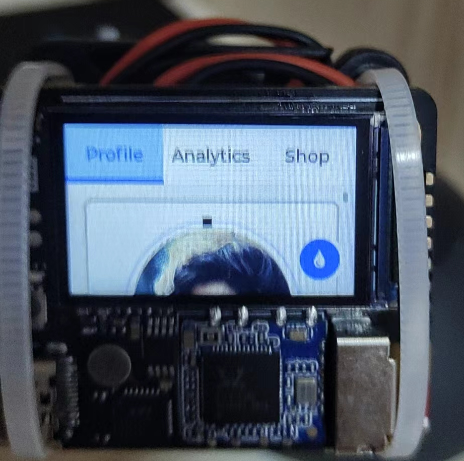

# 嵌入式Linux 移植lvgl记录

因为嵌入式Linux大多都对LCD屏实现framebuffer有驱动支持，因此用了lvgl_drivers中的framebuffer功能，这样各开发板之间去做移植就就不用怎么动驱动层了

quark夸克开发板和100ask imxnull pro开发板的源码都在这里

> [夸克开发板](https://github.com/nobody0know/quark-n-ui/tree/main)
> 
> [100askIMX6NULL_Pro ](https://github.com/nobody0know/quark-n-ui/tree/100askIMX6NULL_Pro)

## 夸克开发板

夸克开发板板载的屏幕尺寸大小为240*135，配置驱动信息时填上屏幕大小信息即可

```c
/*Initialize and register a display driver*/
    static lv_disp_drv_t disp_drv;
    lv_disp_drv_init(&disp_drv);
    disp_drv.draw_buf   = &disp_buf;
    disp_drv.flush_cb   = fbdev_flush;
    disp_drv.hor_res    = 240;
    disp_drv.ver_res    = 135;
    lv_disp_drv_register(&disp_drv);
```

然后屏幕的色深为16bit也就是RGB565，在lv_conf.h里面改色深设置就行

```c
/*Color depth: 1 (1 byte per pixel), 8 (RGB332), 16 (RGB565), 32 (ARGB8888)*/
#define LV_COLOR_DEPTH 16
```

然后我使用的是cmake去构建，因为只用framebuffer的显示驱动在lv_driverd 的cmake里面只编译fbdev.c就行` file(GLOB_RECURSE SOURCES  ./display/fbdev.c)`然后在fbdev.h里面要指明lv_drv_conf.h的路径，**<mark>因为我是外置的这个头文件，不然编译lv_driver库时会报错找不到函数的实现</mark>** **很多编译时报错找不到lvgl的各种函数实现的问题都可能是因为这个原因**

```c
#ifndef LV_DRV_NO_CONF
#ifdef LV_CONF_INCLUDE_SIMPLE
#include "../../lv_drv_conf.h"//这里指出来
#else
#include "../../lv_drv_conf.h"
#endif
#endif
```

然后夸克开发板它的系统默认是跑了一个framebuffer的终端的，这个要关掉，不然就会冲突，它的板载终端就是跑了一个叫getty@tty1.service的服务，systemctl stop掉就行，然后就能跑自己的lvgl程序了



## 100askIMX6NULL_Pro开发板

有了上文的思路，移植基本上就是手到擒来，按上文逻辑，因为这个开发板的屏幕是1024*600的大小而且是32bit色深也就是RGB888，所以也需要相应去调整配置文件，新增的就是因为这个板子有触摸屏，所以我把触摸驱动加进去了，查/dev/input可以看到触摸屏的输入是event1，然后在lv_driver的cmakelist里面加上evdev的相关文件，指明lv_drv_conf.h的路径就行

```c
#ifndef USE_EVDEV
#  define USE_EVDEV           1
#endif

#if USE_EVDEV || USE_BSD_EVDEV
#  define EVDEV_NAME   "/dev/input/event1"        /*You can use the "evtest" Linux tool to get the list of devices and test them*/
```

因为它也是有一个开机的QT例程在占着fb1，所以要先关掉

`/etc/init.d/S99myirhmi2 stop`

然后，然后挑个demo烧进去就有效果了，这次我试了一下NXP的gui guider的软件去图形化配置UI，把lvgl升到了V8.3，跑了个NXP的打印机界面的例程
