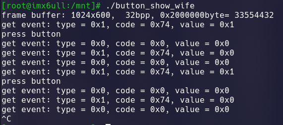

# 嵌入式linux 使用signal读取按键中断

先打开按键外设，按键外设为/dev/input/event0，然后注册按键外设的回调函数，按下按键时触发signal的回调函数，得到event，判断按键按下的event和value去改变是否显示图片的标志位，来实现老婆图片显示与否的切换

```c
//main 函数
if ((button_fd = open("/dev/input/event0", O_RDWR | O_NONBLOCK)) < 0)
{
        perror(__func__);
        return (-1);
}
        signal(SIGIO, sig_callback);
        /* 把APP的进程号告诉驱动程序 */
        fcntl(button_fd, F_SETOWN, getpid());

        /* 使能"异步通知" */
        unsigned int flags = fcntl(button_fd, F_GETFL);
        fcntl(button_fd, F_SETFL, flags | FASYNC);
```

```c
//回调函数
void sig_callback(int sig)
{
        struct input_event event;
        while (read(button_fd, &event, sizeof(event)) == sizeof(event))
        {
                printf("get event: type = 0x%x, code = 0x%x, value = 0x%x\n", event.type, event.code, event.value);
                if (event.type == 0x1 && event.value == 0x1)
                {
                   if (bool_show_wife == 0)
                       {
                             bool_show_wife = 1;
                        }
                        else
                             bool_show_wife = 0;
                         printf("press button\n");
                        }
                }
        }
}
```



所有代码

```c
#include <errno.h>
#include <sys/types.h>
#include <sys/stat.h>
#include <fcntl.h>
#include <sys/ioctl.h>
#include <unistd.h>
#include <stdint.h>
#include <stdio.h>
#include <stdlib.h>
#include <asm/types.h>
#include <linux/videodev2.h>
#include <sys/mman.h>
#include <string.h>
#include <malloc.h>
#include <linux/fb.h>
#include <signal.h>
#include <unistd.h>
#include <linux/input.h>

#include <jpeglib.h>

#include <jerror.h>

struct fb_dev
{
        // for frame buffer
        int fb;
        void *fb_mem; // frame buffer mmap
        int fb_width, fb_height, fb_line_len, fb_size;
        int fb_bpp;
} fbdev;

// 得到framebuffer的长、宽和位宽，成功则返回0，失败返回－1
int fb_stat(int fd)
{
        struct fb_fix_screeninfo fb_finfo;
        struct fb_var_screeninfo fb_vinfo;

        if (ioctl(fd, FBIOGET_FSCREENINFO, &fb_finfo))
        {
                perror(__func__);
                return (-1);
        }

        if (ioctl(fd, FBIOGET_VSCREENINFO, &fb_vinfo))
        {
                perror(__func__);
                return (-1);
        }

        fbdev.fb_width = fb_vinfo.xres;
        fbdev.fb_height = fb_vinfo.yres;
        fbdev.fb_bpp = fb_vinfo.bits_per_pixel;
        fbdev.fb_line_len = fb_finfo.line_length;
        fbdev.fb_size = fb_finfo.smem_len;

        return (0);
}

// 释放framebuffer的映射
int fb_munmap(void *start, size_t length)
{
        return (munmap(start, length));
}

// 显示一个像素点的图像到framebuffer上
int fb_pixel(void *fbmem, int width, int height, int x, int y, unsigned int color)
{
        if ((x > width) || (y > height))
                return (-1);

        unsigned int *dst = ((unsigned int *)fbmem + y * width + x);

        *dst = color;
        return 0;
}
int bool_show_wife = 0;

int button_fd;
struct jpeg_decompress_struct cinfo;
FILE *infile;
int fb;

char s[15];
struct jpeg_error_mgr jerr;
int show_wife(struct jpeg_decompress_struct cinfo)
{
        if ((infile = fopen("lcd.jpg", "rb")) == NULL)
        {
                fprintf(stderr, "open %s failed\n", s);
                exit(-1);
        }
        ioctl(fb, FBIOBLANK, 0); // 打开LCD背光

        cinfo.err = jpeg_std_error(&jerr);
        jpeg_create_decompress(&cinfo);

        // 导入要解压的Jpeg文件infile
        jpeg_stdio_src(&cinfo, infile);
        // 读取jpeg文件的文件头
        jpeg_read_header(&cinfo, TRUE);
        long long x, y;
        unsigned char *buffer;
        // memset(fbdev.fb_mem, 0xff, fbdev.fb_size);
        //  开始解压Jpeg文件，解压后将分配给scanline缓冲区，
        jpeg_start_decompress(&cinfo);

        buffer = (unsigned char *)malloc(cinfo.output_width * cinfo.output_components);
        y = 0;
        while (cinfo.output_scanline < cinfo.output_height)
        {
                jpeg_read_scanlines(&cinfo, &buffer, 1);

                unsigned int color;
                for (x = 0; x < cinfo.output_width; x++)
                {
                    color = buffer[x * 3] << 16 | buffer[x * 3 + 1] << 8 | buffer[x * 3 + 2];
                    // color = RGB888toRGB565(buffer[x * 3 ],buffer[x * 3 + 1],buffer[x * 3 +2]);
                    fb_pixel(fbdev.fb_mem, fbdev.fb_width, fbdev.fb_height, x, y, color);
                }

                y++;
        }
        // 释放帧缓冲区
        free(buffer);
        // 完成Jpeg解码，释放Jpeg文件
        jpeg_finish_decompress(&cinfo);
        jpeg_destroy_decompress(&cinfo);
        // 关闭Jpeg输入文件
        fclose(infile);
}

void sig_callback(int sig)
{
        struct input_event event;
        while (read(button_fd, &event, sizeof(event)) == sizeof(event))
        {
                printf("get event: type = 0x%x, code = 0x%x, value = 0x%x\n", event.type, event.code, event.value);
                if (event.type == 0x1 && event.value == 0x1)
                {
                        //  usleep(100);
                        //  read(button_fd, &event, sizeof(event)) == sizeof(event);
                        //  if (event.type == 0x1 && event.value == 0x1)
                        {
                                

                                if (bool_show_wife == 0)
                                {
                                        bool_show_wife = 1;
                                }
                                else
                                        bool_show_wife = 0;
                                printf("press button\n");
                        }
                }
        }
}
int main(int argc, char **argv)
{

        if ((fb = open("/dev/fb0", O_RDWR)) < 0) // 打开显卡设备
        {
                perror(__func__);
                return (-1);
        }
        if ((button_fd = open("/dev/input/event0", O_RDWR | O_NONBLOCK)) < 0)
        {
                perror(__func__);
                return (-1);
        }
        signal(SIGIO, sig_callback);
        /* 把APP的进程号告诉驱动程序 */
        fcntl(button_fd, F_SETOWN, getpid());

        /* 使能"异步通知" */
        unsigned int flags = fcntl(button_fd, F_GETFL);
        fcntl(button_fd, F_SETFL, flags | FASYNC);

        // 获取framebuffer的状态
        fb_stat(fb); // 获取显卡驱动中的长、宽和显示位宽
        printf("frame buffer: %dx%d,  %dbpp, 0x%xbyte= %d\n",
               fbdev.fb_width, fbdev.fb_height, fbdev.fb_bpp, fbdev.fb_size, fbdev.fb_size);

        // 映射framebuffer的地址
        fbdev.fb_mem = mmap(NULL, fbdev.fb_size, PROT_READ | PROT_WRITE, MAP_SHARED, fb, 0);

        while (1)
        {
                if (bool_show_wife == 1)
                {
                        show_wife(cinfo);
                }
                else
                {
                        memset(fbdev.fb_mem, 0xff, fbdev.fb_size);
                }
                // sleep(2);
        }

        fb_munmap(fbdev.fb_mem, fbdev.fb_size); // 释放framebuffer映射

        close(fb);
}

```
