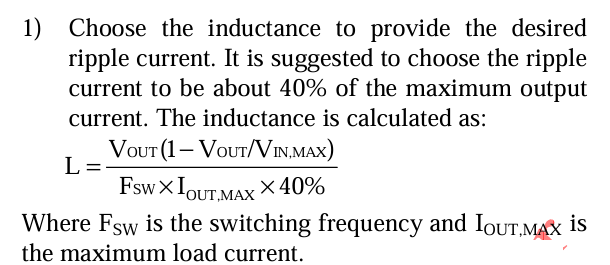

# 嵌入式硬件设计备忘录—原理图篇

## DCDC降压芯片原理图设计注意点—以SY8088I为例子

### 输出所需电压计算方式

一般DCDC降压芯片都是通过测量FB反馈引脚上的电压值并与参考电压通过比较器来控制输出开关的占空比来实现不同电压的降压输出

如图为常用的DCDC降压芯片SY8088I的芯片原理图，可见这个芯片的参考电压为0.6V，然后LX是连接电感的引脚，因为DCDC芯片的原理中降压输出是通过电感续流实现的，所以其实LX引脚就是输出引脚，通过电感输出降压后的电压

FB反馈引脚通过分压电阻来实现降压的测量，这里为了避免分压电阻产生额外的热功耗，反馈电阻的阻值一般会选大一些，如100K到1M欧之间

如图为SY8088I计算Vout的公式，Vout由分压电路的RH和RL以及芯片内部FB引脚使用的参考电压共同决定，参考电压上图芯片原理图中可以看到为0.6V

如参考设计中所画的，LX输出通过电感后Vout输出并将输出电压通过电阻分压电路反馈到FB引脚，可以通过公式计算得到按参考设计的话输出电压就是1.8V，如果需要3.3V，RH不变的情况下，计算得RL需要22.2K欧的电阻，考虑到电阻便于购买的情况，选用22.1K欧的电阻

$$
V_{out} = {(0.6*100K)\over 49.9K} + 0.6V ≈ 1.802
$$

当然像SY8088I的手册比较良心，会基于厂家测试给出常用电压建议的电阻选型值，就不用算了

### 电容选型注意点

#### 1.电容耐压问题

电容选型首先是看耐压值，所选型电容的耐压值要高于工作电压，像本电路Vin是2.5V~5.5V，Vout是0~Vin的范围，因此电容可以用常见的6.3V耐压，但是如果是工作在比如24V降压3.3V之类的场景，那电容就最好是50V高耐压值的，加上贴片陶瓷电容的容值是会随着电压而下降的，图中可以看到，6.3V耐压的电容工作在5V时都有20%的容值损耗，所以如果成本允许可以选择高耐压的电容，防止电路失效

#### 2.电容滤波问题

因为DCDC芯片是通过调整开关MOS管的频率来实现占空比输出的，那必然会导致电路产生纹波和开关噪声，因此需要在输入输出都并上到地的滤波电容来滤除自身产生的噪声以及其他器件带来的耦合噪声。

图中为阻抗频率曲线，可以看到在不同频率下不同容值的电容的阻抗，在频率比较低（比较小）的时候，容抗远大于感抗，电容主要成容性，在频率比较高的时候，电容主要呈感性，在曲线谷底为谐振频率，在谐振时容抗和感抗都为0，此时电容阻抗最小，表现为纯电阻特性。

### 电感选型注意点

#### 1.电感值选型

在SY8088I的datasheet中建议电感值选型的计算中对电感电流的平均值Iout（纹波电流）以最大输出电流的40%来计算所需电感值，为了确保电感在开关期间能够产生合适的纹波电流保证续流但不会电流过大导致输出电压不稳，提高电源的动态响应避免电感产生过高的开关噪声

式子中（Vout/Vin，Max）其实就是占空比

> https://zhuanlan.zhihu.com/p/671513803

#### 2.电感饱和电流选型

电感的饱和电流等级必须大于满载条件下的峰值电感电流。为了确保电感不会在高负载下进入饱和状态。电感的饱和现象是指电感电流增加到一定程度时，电感的感抗（Inductance）显著下降，甚至接近于零。这会导致电感无法正常发挥储能的效果，这会导致电流波形不再线性，从而影响电源的正常工作。选择一个足够大的饱和电流等级，可以确保在高负载时电感仍然能够正常工作，保持较高的效率和稳定性。

#### 3.电感的直流电阻与核心损耗问题

为保持DCDC芯片的设计效率，应该选型合适直流电阻（DCR）的电感，减少电感直流电阻导致的热损耗，这个一般问题不大，除非对板子的低功耗要求特别高以及对板子的发热的控制特别严格，这个参数一般问题不大

## 主控芯片原理图设计的注意点

### 1.特殊管脚的上下拉电阻和延时电容

如芯片是BOOT，RESET/EN等特殊管脚，需要记得严格按照芯片手册中所说的按诸如启动方式、上电时序等选择上下拉电阻以及延时电容

## LED限流电路中电阻的选型

