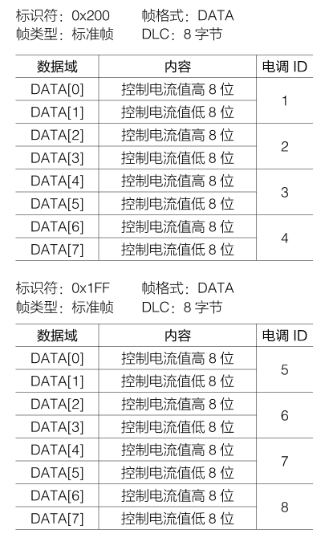
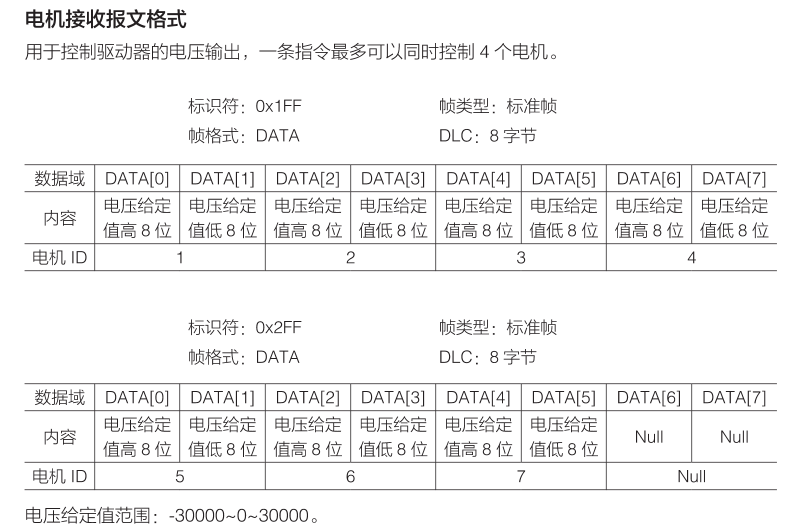

# C620电调和GM6020在can发送控制信号时的坑

注意C620发送控制信号帧头在1-4号电机是0x200而5-8号电机是0x1FF

而GM6020发送控制信号时帧头在1-4号电机是0x1FF而5-6号电机则是0x2FF

<mark>但是GM6020发送控制信号的ID在反馈报文中是从0x205开始往上加，ID=1则反馈报文为0x205,所以一般云台电机反馈报文为0x205，0x206则ID为1，2</mark>

所以使用CAN_cmd_motor时要注意CMD_ID的配置

