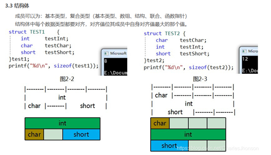
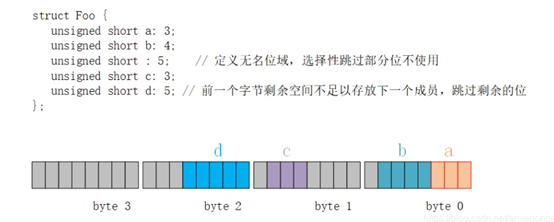
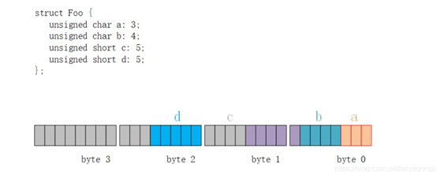
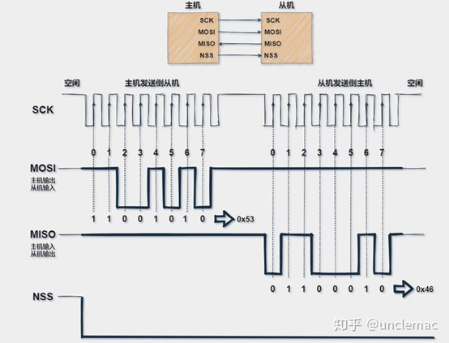
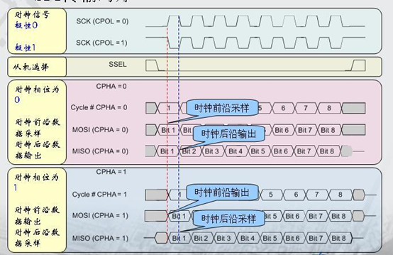
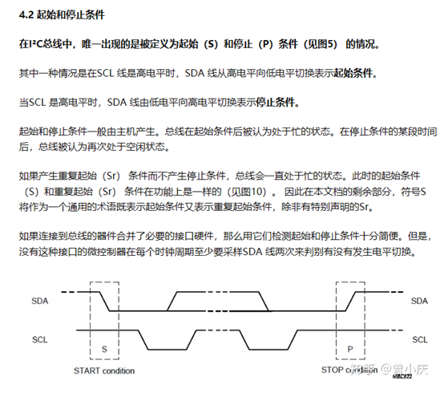
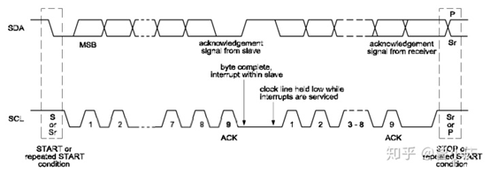
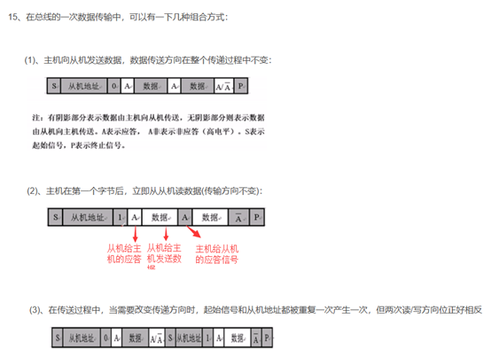
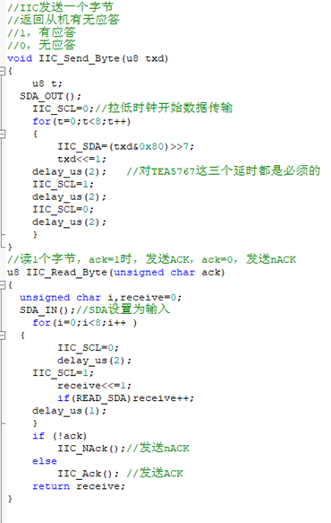
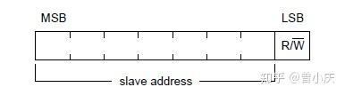

# 嵌入式软件知识面试宝典

## static关键字：

静态局部变量使用static修饰符定义，即使在声明时未赋初值，编译器也会把它初始化为0。且静态局部变量存储于进程的全局数据区，即使函数返回，它的值也会保持不变。

变量在全局数据区分配内存空间；编译器自动对其初始化  
其作用域为局部作用域，当定义它的函数结束时，其作用域随之结束

普通全局变量对整个工程可见，其他文件可以使用extern外部声明后直接使用。也就是说其他文件不能再定义一个与其相同名字的变量了（否则编译器会认为它们是同一个变量）。但是静态全局变量仅对当前文件可见，其他文件不可访问，其他文件可以定义与其同名的变量，两者互不影响。

静态函数只能在声明它的文件中可见，其他文件不能引用该函数

不同的文件可以使用相同名字的静态函数，互不影响

非静态函数可以在另一个文件中直接引用，甚至不必使用extern声明

**静态数据成员**

在类内数据成员的声明前加上static关键字，该数据成员就是类内的静态数据成员。其特点如下：

静态数据成员存储在全局数据区，静态数据成员在定义时分配存储空间，所以不能在类声明中定义

静态数据成员是类的成员，无论定义了多少个类的对象，静态数据成员的拷贝只有一个，且对该类的所有对象可见。也就是说任一对象都可以对静态数据成员进行操作。而对于非静态数据成员，每个对象都有自己的一份拷贝。

由于上面的原因，静态数据成员不属于任何对象，在没有类的实例时其作用域就可见，在没有任何对象时，就可以进行操作

和普通数据成员一样，静态数据成员也遵从public, protected,
private访问规则

静态数据成员的初始化格式：<数据类型><类名>::<静态数据成员名>=<值>

类的静态数据成员有两种访问方式：<类对象名>.<静态数据成员名> 或 <类类型名>::<静态数据成员名>

同全局变量相比，使用静态数据成员有两个优势：

静态数据成员没有进入程序的全局名字空间，因此不存在与程序中其它全局名字冲突的可能性；可以实现信息隐藏。静态数据成员可以是private成员，而全局变量不能

**静态成员函数**

与静态数据成员类似，静态成员函数属于整个类，而不是某一个对象，其特性如下：

静态成员函数没有this指针，它无法访问属于类对象的非静态数据成员，也无法访问非静态成员函数，它只能调用其余的静态成员函数

出现在类体外的函数定义不能指定关键字static

非静态成员函数可以任意地访问静态成员函数和静态数据成员

extern表明变量或者函数是定义在其他其他文件中的

例如：extern int a;

显式的说明了a的存储空间是在程序的其他地方分配的，在文件中其他位置或者其他文件中寻找a这个变量。

用法

l  一个c文件需要调用同一个c文件但是在后面定义的，用extern预先声明或者引用另一个c文件里的变量或者函数

（一个项目里，一个.h文件可能会被多个.c源文件包含，这样编译的时候就会报重复定义的错误。而且尽量不要在.h里定义变量，这是一个不好的习惯。）

l  对于函数而言，和引用变量是一样的，如果需要调用其他.c文件中的函数，在文件中的函数声明前加extern即可，不加extern而直接声明函数也可以，因为声明全局函数默认前面带有extern。

如果不想让其他.c文件引用本文件中的变量，加上static即可。

## 结构体与联合体

一、结构体struct

    各成员各自拥有自己的内存，各自使用互不干涉，同时存在的，遵循内存对齐原则。一个struct变量的总长度等于所有成员的长度之和。

二、联合体union

    各成员共用一块内存空间，并且同时只有一个成员可以得到这块内存的使用权(对该内存的读写)，各变量共用一个内存首地址。因而，联合体比结构体更节约内存。一个union变量的总长度至少能容纳最大的成员变量，而且要满足是所有成员变量类型大小的整数倍。不允许对联合体变量名U2直接赋值或其他操作。

代码3:union大小计算

    union大小计算准则：1、至少要容纳最大的成员变量 2、必须是所有成员变量类型大小的整数倍

代码中U3至少容纳最大e[5]=20字节，同时变量类型最大值是整数倍，即使double(字节数是8)的整数倍，因而sizeof(U3)=24。

//联合体

union u2 

{

    char a;  

    int b;

    short c;

    double d;

    int e[5];

}U3;

代码5:struct字节对齐

    U5中a四个字节，后面b和c加起来3个字节，正好补1个字节对齐；U6中b1个字节，要和后面的a对齐，需要补3个字节对齐(CPU一次读取4字节)，c也要补1个字节对齐，因而最终U6为12个字节。另外，要想改变这种默认对齐设置，可以用

#pragma pack (2) /*指定按2字节对齐*/

#pragma pack () /*取消指定对齐，恢复缺省对齐*/

//联合体

struct u4 

{

    int a; //4B

    char b;//1B

    short c; //2B

}U5;

struct u5 

{

    char b;//1B

    int a;  //4B

    short c; //1B

}U6;

int main(){

    printf("%d\n",sizeof(U5));

    printf("%d\n",sizeof(U6));

    return 0;

}

//输出为

//8

//12

位域的定义与引用

位域不同于一般的结构体成员，它以位为单位来定义成员的长度，因此在结构体中定义位域时，必须要指明位域成员所需要占用的二进制位数。一个简单的定义位域的示例如下：

结构体中位域在内存中的存储遵循以下规则：

若相邻的位域成员的类型相同，且其占用二进制位数未超过该类型可容纳的范围，则后面的成员紧接着前一个成员进行存储；

若相邻的位域成员的类型相同，但其占用二进制位数超过该类型可容纳的范围，则后面的成员从该类型占用空间之后的内存单元开始存储;

若相邻的位域成员的类型不同，则取决于编译器的实现。对于GCC编译器会尽量利用空闲的位对数据进行存储；

若位域之间定义有匿名位域成员，则匿名位域成员指定的空闲位不用于后续成员的数据存储；

联合体好玩的是如果传输都是小端序的话，如果发送方的数据协议中，8字节的can报文中有24bit的数据是我要的数据的话，我可以直接定义一个联合体其中有1个uint32的数据和4个uint8的数组，初始化置零后将3字节的数据直接在中断中赋值到这个联合体的数组里面，CPU直接读取uint32位的那个数据，即是我需要的数据，不需要做位运算，简单直观。

## 三目运算符的运算规则

三目运算符语法 布尔表达式?表达式1:表达式2 

运算过程：如果布尔表达式的值为 true ，则返回 表达式1 的值，否则返回 表达式2 的值

## 堆和栈

堆（Heap）与栈（Stack）是开发人员必须面对的两个概念，在理解这两个概念时，需要放到具体的场景下，因为不同场景下，堆与栈代表不同的含义。一般情况下，有两层含义：
（1）程序内存布局场景下，堆与栈表示两种内存管理方式；
（2）数据结构场景下，堆与栈表示两种常用的数据结构。
1.1 栈简介
栈由操作系统自动分配释放 ，用于存放函数的参数值、局部变量等，其操作方式类似于数据结构中的栈。参考如下代码：
int main() {
    int b;                //栈
    char s[] = "abc";     //栈
    char *p2;            //栈
}
其中函数中定义的局部变量按照先后定义的顺序依次压入栈中，也就是说相邻变量的地址之间不会存在其它变量。栈的内存地址生长方向与堆相反，由高到底，所以后定义的变量地址低于先定义的变量，比如上面代码中变量 s 的地址小于变量 b 的地址，p2 地址小于 s 的地址。栈中存储的数据的生命周期随着函数的执行完成而结束。
1.2 堆简介
堆由开发人员分配和释放， 若开发人员不释放，程序结束时由 OS 回收，分配方式类似于链表。参考如下代码：
int main() {
    // C 中用 malloc() 函数申请
    char* p1 = (char *)malloc(10);
    cout<<(int*)p1<<endl;        //输出：00000000003BA0C0

    // 用 free() 函数释放
    free(p1);

    // C++ 中用 new 运算符申请
    char* p2 = new char[10];
    cout << (int*)p2 << endl; //输出：00000000003BA0C0

    // 用 delete 运算符释放
    delete[] p2;

}
其中 p1 所指的 10 字节的内存空间与 p2 所指的 10 字节内存空间都是存在于堆。堆的内存地址生长方向与栈相反，由低到高，但需要注意的是，后申请的内存空间并不一定在先申请的内存空间的后面，即 p2 指向的地址并不一定大于 p1 所指向的内存地址，原因是先申请的内存空间一旦被释放，后申请的内存空间则会利用先前被释放的内存，从而导致先后分配的内存空间在地址上不存在先后关系。堆中存储的数据若未释放，则其生命周期等同于程序的生命周期。
关于堆上内存空间的分配过程，首先应该知道操作系统有一个记录空闲内存地址的链表，当系统收到程序的申请时，会遍历该链表，寻找第一个空间大于所申请空间的堆节点，然后将该节点从空闲节点链表中删除，并将该节点的空间分配给程序。另外，对于大多数系统，会在这块内存空间中的首地址处记录本次分配的大小，这样，代码中的delete语句才能正确地释放本内存空间。由于找到的堆节点的大小不一定正好等于申请的大小，系统会自动地将多余的那部分重新放入空闲链表。
1.3 堆与栈区别
堆与栈实际上是操作系统对进程占用的内存空间的两种管理方式，主要有如下几种区别：
（1）管理方式不同。栈由操作系统自动分配释放，无需我们手动控制；堆的申请和释放工作由程序员控制，容易产生内存泄漏；
（2）空间大小不同。每个进程拥有的栈大小要远远小于堆大小。理论上，进程可申请的堆大小为虚拟内存大小，进程栈的大小 64bits 的 Windows 默认 1MB，64bits 的 Linux 默认 10MB；
（3）生长方向不同。堆的生长方向向上，内存地址由低到高；栈的生长方向向下，内存地址由高到低。
（4）分配方式不同。堆都是动态分配的，没有静态分配的堆。栈有 2 种分配方式：静态分配和动态分配。静态分配是由操作系统完成的，比如局部变量的分配。动态分配由alloca()函数分配，但是栈的动态分配和堆是不同的，它的动态分配是由操作系统进行释放，无需我们手工实现。
（5）分配效率不同。栈由操作系统自动分配，会在硬件层级对栈提供支持：分配专门的寄存器存放栈的地址，压栈出栈都有专门的指令执行，这就决定了栈的效率比较高。堆则是由C/C++提供的库函数或运算符来完成申请与管理，实现机制较为复杂，频繁的内存申请容易产生内存碎片。显然，堆的效率比栈要低得多。
（6）存放内容不同。栈存放的内容，函数返回地址、相关参数、局部变量和寄存器内容等。当主函数调用另外一个函数的时候，要对当前函数执行断点进行保存，需要使用栈来实现，首先入栈的是主函数下一条语句的地址，即扩展指针寄存器的内容（EIP），然后是当前栈帧的底部地址，即扩展基址指针寄存器内容（EBP），再然后是被调函数的实参等，一般情况下是按照从右向左的顺序入栈，之后是被调函数的局部变量，注意静态变量是存放在数据段或者BSS段，是不入栈的。出栈的顺序正好相反，最终栈顶指向主函数下一条语句的地址，主程序又从该地址开始执行。堆，一般情况堆顶使用一个字节的空间来存放堆的大小，而堆中具体存放内容是由程序员来填充的。
从以上可以看到，堆和栈相比，由于大量malloc()/free()或new/delete的使用，容易造成大量的内存碎片，并且可能引发用户态和核心态的切换，效率较低。栈相比于堆，在程序中应用较为广泛，最常见的是函数的调用过程由栈来实现，函数返回地址、EBP、实参和局部变量都采用栈的方式存放。虽然栈有众多的好处，但是由于和堆相比不是那么灵活，有时候分配大量的内存空间，主要还是用堆。
无论是堆还是栈，在内存使用时都要防止非法越界，越界导致的非法内存访问可能会摧毁程序的堆、栈数据，轻则导致程序运行处于不确定状态，获取不到预期结果，重则导致程序异常崩溃，这些都是我们编程时与内存打交道时应该注意的问题。

## SPI和IIC

<mark>**SPI 为全双工 IIC为半双工**</mark>

### SPI

整体的传输大概可以分为以下几个过程：
主机先将NSS信号拉低，这样保证开始接收数据；
当接收端检测到时钟的边沿信号时，它将立即读取数据线上的信号，这样就得到了一位数据（1bit）;
由于时钟是随数据一起发送的，因此指定数据的传输速度并不重要，尽管设备将具有可以运行的最高速度（稍后我们将讨论选择合适的时钟边沿和速度）。
主机发送到从机时：主机产生相应的时钟信号，然后数据一位一位地将从MOSI信号线上进行发送到从机；
主机接收从机数据：如果从机需要将数据发送回主机，则主机将继续生成预定数量的时钟信号，并且从机会将数据通过MISO信号线发送；

MISO：Master input slave output 主机输入，从机输出（数据来自从机）；

MOSI：Master output slave input 主机输出，从机输入（数据来自主机）；

SCLK ：Serial Clock 串行时钟信号，由主机产生发送给从机；

NSS/CS：Slave Select 片选信号，由主机发送，以控制与哪个从机通信，通常是低电平有效信号。

SPI有以下四种模式

### IIC

5、传输数据
5.1 字节格式
发送到SDA 线上的每个字节必须为8 位。每次传输可以发送的字节数量不受限制。每个字节后必须跟一个响应位。首先传输的是数据的最高位（MSB）（ 见图6）。 如果从机要完成一些其他功能后（例如一个内部中断服务程序）才能接收或发送下一个完整的数据字节，可以使时钟线SCL 保持低电平迫使主机进入等待状态。当从机准备好接收下一个数据字节并释放时钟线SCL 后，数据传输继续。
5.2 响应
数据传输必须带响应。相关的响应时钟脉冲由主机产生。在响应的时钟脉冲期间，发送器释放SDA 线（高）。
在响应的时钟脉冲期间，接收器必须将SDA 线拉，低使它在这个时钟脉冲的高电平期间保持稳定的低电平（见图7）。 当然，必须考虑建立和保持时间。
通常，被寻址的接收器在接收到的每个字节后，除了用CBUS 地址开头的报文，必须产生一个响应。
当从机不能响应从机地址时（例如它正在执行一些实时函数不能接收或发送），从机必须使数据线保持高电平。主机然后产生一个停止条件终止传输或者产生重复起始条件开始新的传输。
如果从机接收器响应了从机地址但是在传输了一段时间后不能接收更多数据字节，主机必须再一次终止传输。这个情况用从机在第一个字节后没有产生响应来表示。从机使数据线保持高电平，主机产生一个停止或重复起始条件。
如果传输中有主机接收器，它必须通过在从机不产生时钟的最后一个字节不产生一个响应，向从机发送器通知数据结束。从机发送器必须释放数据线，允许主机产生一个停止或重复起始条件。

#### 模拟IIC

（如果能使用硬件IIC最好别用模拟IIC，模拟IIC中正点原子的us延时对主频速率要求很严格，需要严格配置主频，可以使用DWT时钟来进行延时）

> [52. DWT—内核定时器 &mdash; [野火]STM32库开发实战指南——基于野火霸道开发板 文档](https://doc.embedfire.com/mcu/stm32/f103badao/std/zh/latest/book/DWT.html)

主机写时先将SDA设置为~~推挽输出~~模式（应该要设置为开漏输出然后外接一个上拉电阻（不是输入的那个上拉电阻，是外面另外接一个上拉电阻），防止主机推挽输出高电平然后从机推挽低电平直接短路烧芯片）再拉低SCL然后通过跳变SDA去轮流发送8bit此时SCL保持拉低，传输完一个字节（8bit）后延时一2us拉高SCL再延时2us拉低SCL，然后设置SDA为浮空输入模式，拉高SCL和SDA等待从机拉低SDA并产生SCL的方波时间周期实现ACK
主机读取从机数据时先将SDA设置为~~浮空输入~~（不需要设置为输入模式，开漏输出模式下可直接读取外部输入的IO电平）模式然后拉低SCL再拉高SCL进入读取模式，此时SCL保持拉高，轮流读取8个bit后发送ACK给从机。
可以参考这个文章：

> [模拟IIC——关于模拟IIC的IO口的配置选取推挽输出还是开漏输出，以及是否需要更改IO口输入输出模式和是否需要对IO配置上拉_推挽输出模拟i2c-CSDN博客](https://blog.csdn.net/m0_62243928/article/details/125779308)
> 
> [stm32模拟IIC(I2C)踩过的坑与总结，小白入
> 
> - 知乎 (zhihu.com)](https://zhuanlan.zhihu.com/p/338377414)
> 
> [深刻理解GPIO(上拉输入、下拉输入、模拟输入、浮空输入，开漏输出，推挽输出的区别，以STM32为例)_下拉输出-CSDN博客](https://blog.csdn.net/scarecrow_sun/article/details/120287852)
> 
> [软件模拟I2C据说IO口没有设置为开漏很容易损坏芯片,大家有没碰到过？ (amobbs.com 阿莫电子论坛 - 东莞阿莫电子网站)](https://www.amobbs.com/thread-5659439-1-1.html)

<mark>总结：主机输出时直接拉低SCL保持低电平，输入时SCL拉低再拉高后保持高电平</mark>

7、7 位的地址格式
数据的传输遵循图10 所示的格式。在起始条件（S） 后，发送了一个从机地址。这个地址共有7 位，紧接着的第8 位是数据方向位（R/W）—“0”表示发送（写），“1”表示请求数据（读）。数据传输一般由主机产生的停止位（P） 终止。但是，如果主机仍希望在总线上通讯，它可以产生重复起始条件（Sr）和寻址另一个从机，而不是首先产生一个停止条件。在这种传输中，可能有不同的读/写格式结合。
8、7 位寻址
I²C总线的寻址过程是通常在起始条件后的第一个字节决定了主机选择哪一个从机。例外的情况是可以寻址所有器件的“广播呼叫”地址。使用这个地址时，理论上所有器件都会发出一个响应。但是，也可以使器件忽略这个地址。广播呼叫地址的第二个字节定义了要采取的行动。
8.1 第一个字节的位定义
第一个字节的头7 位组成了从机地址（见图14）。 最低位（LSB） 是第8 位。它决定了报文的方向。第一个字节的最低位（大端序，高位在前，所以LSB位在最后是最低位）是“0”表示主机会写信息到被选中的从机。“1”表示主机会向从机读信息。
当发送了一个地址后，系统中的每个器件都在起始条件后将头7 位与它自己的地址比较。如果一样，器件会任务它被主机寻址，至于是从机—接收器还是从机—发送器都由R/W 位决定。

