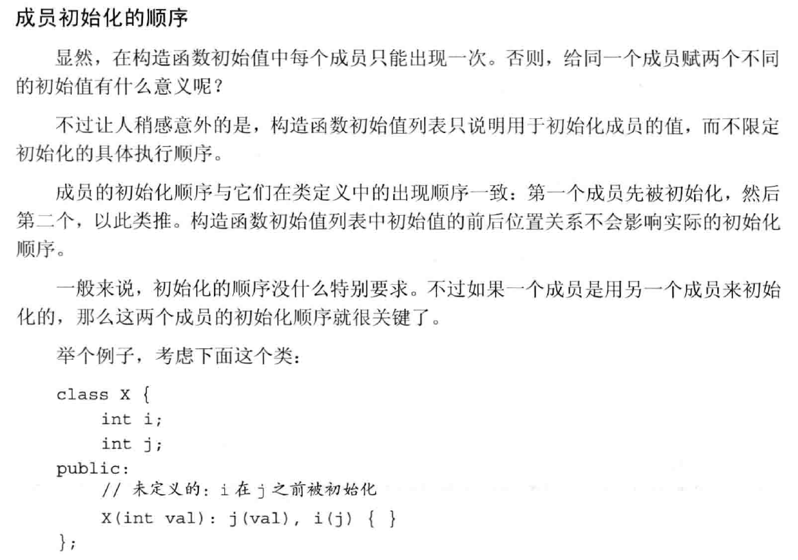

# C++ 类学习

## 析构函数与复制构造函数的坑

> 复制构造函数语法：
> 
>             类名 ( const 类名 `&` )     //复制构造函数的典型声明
> 
>             类名 ( const 类名 `&` ) = default; //强制编译器生成复制构造函数
> 
>             类名 ( const 类名 `&` ) = delete;  //阻止隐式生成复制构造函数
> 
> 析构函数语法：
> 
>             ~ 类名 ( );  //析构函数的典型声明
> 
>             ~ 类名 ( ) = default; //强迫编译器生成析构函数
> 
>              ~类名 ( ) = delete; //禁用隐式析构函数

```cpp
struct A
{
    int n;
    A(int n = 1) : n(n) { }
    A(const A& a) : n(a.n) { } // 用户定义的复制构造函数
};

struct B : A
{
    // 隐式默认构造函数 B::B()
    // 隐式复制构造函数 B::B(const B&)
};

int main()
{
    A a1(7);
    A a2(a1); // 调用复制构造函数
    B b;
    B b2 = b; //使用隐式默认复制构造函数
    A a3 = b; // 转换到 A& 并调用复制构造函数

}
```

若定义类一个类A有两个实例a，b，且a中成员有指针并且在构造函数中对其使用了new去申请了空间，当使用b=a这种方法去给b赋初值时调用隐式默认复制构造函数时会将b的指针成员赋值为a所开辟的空间的首地址，在构造时倒没什么问题，但是在当a，b到达生命域结束所调用析构函数时b释放了a开辟的空间然后a又对这个已经被释放的空间再次执行析构函数进行释放则会造成段错误导致程序崩溃。

> 析构函数也可以直接调用，例如销毁用[布置 new](https://zh.cppreference.com/w/cpp/language/new "cpp/language/new") 或通过分配器成员函数（如 [destroy()](https://zh.cppreference.com/w/cpp/memory/allocator/destroy "cpp/memory/allocator/destroy")）构造的对象。注意，对普通对象（如局部变量）直接调用析构函数会导致在作用域结束处再次调用析构函数时引发未定义行为。



## static静态成员/函数

## 静态数据成员

1.可以被各个对象所共用，而不只属于某个对象  
<mark>2.静态数据成员的初始化应该在主函数调用前，并且不可以在类里面声明，只能在类外进行初始化</mark>

如果未初始化，则使用会报错[undefined reference to 'XXX::xxxx' ]

static在类中定义了一个静态成员n，在实例化后无论这个类实例化了多少数量，这个static成员只有一个n，多个实例去访问n也只会访问到同一个n

> 静态数据成员不关联到任何对象。即使不定义类的任何对象它们也存在。整个程序中只有一个拥有静态[存储期](https://zh.cppreference.com/w/cpp/language/storage_duration "cpp/language/storage duration")的静态数据成员实例
> 
> 静态成员函数不关联到任何对象。调用时，它们没有 this 指针。

static静态成员函数，因为static静态函数不属于任何实例，没有this指针所以无法访问类中的非静态成员（没有实例不知道该指向谁的非静态成员）

但是非静态成员函数能访问static静态成员

cin>>n

ST s[n]错，编译时不知道要分配多少空间

```c
可以 ST *p
p = new ST [n]
```

构造函数里不能调用虚函数，会因为找不到具体实现的函数而错误

防止出现

        A

    /        \

C              D

\                /

        E

导致因为父类A有一个变量t，E从C和D继承过来导致E有两个变量t的问题，E在继承时可以用virtual修饰，解决E有两个拷贝的问题。
