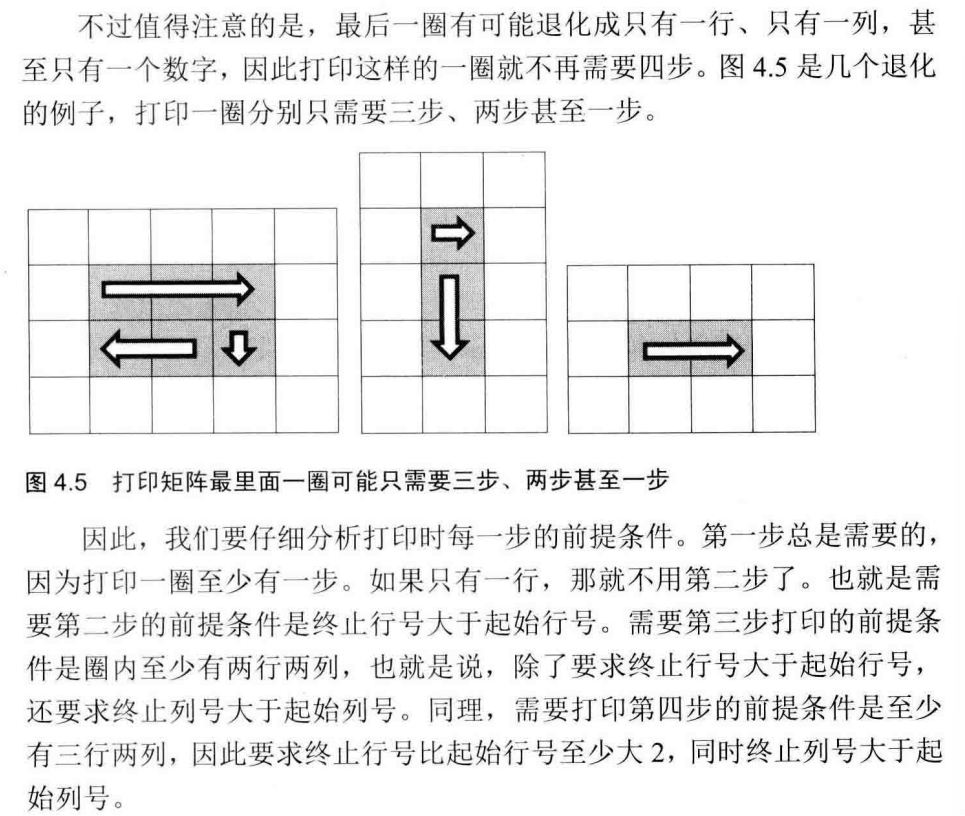
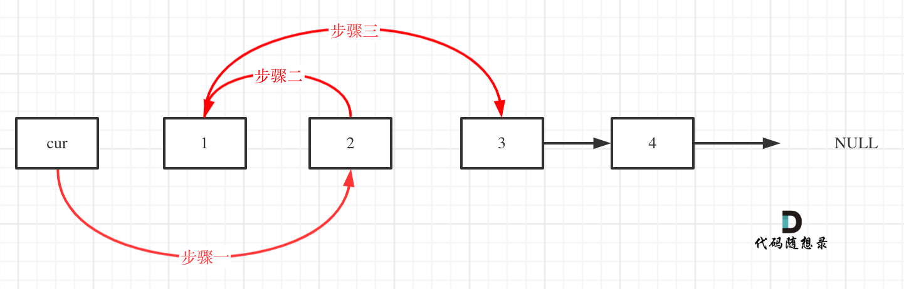
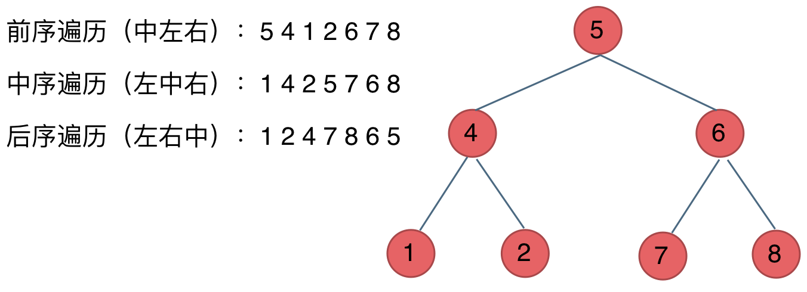

# 代码随想录刷题记录

## 二分查找

### 2024/7/6

### 69.X的平方根
https://leetcode.cn/problems/sqrtx/description/

#### 思路

二分查找，找的目标target就是targer x target偏小最接近输入x的那个，即整数部分然后因为是平方根，边界就是[0,x]，然后如果middle x middle 小于x也就是说平方根在右区间，左边界变化

```cpp 
class Solution {
public:
    int mySqrt(int x) {
        int l = 0;
        int r = x;
        int ans = 0;
        while(l<=r)
        {
            int middle = l + (r-l)/2;
            if((long long)middle * middle <=x)
            {
                ans = middle;//这里定答案是为了防止算出来平方根偏大1的问题
                l = middle+1;
            }
            else
            {
                r = middle - 1;
            }
        }
        return ans;
    }
};
```

## 移除元素

### 2024/7/6

### 26.删除有序数组中的重复项

https://leetcode.cn/problems/remove-duplicates-from-sorted-array/description/

#### 思路

采取快慢指针的方法，因为是删除重复项目，那令遍历从1开始然后当nums[i-1] != nums[i]时把nums[i]写到慢指针的所指处，然后更新慢指针即nums[slowindex++] = nums[i]，此处先赋值再加加,然后考虑到nums至少得有一个，slowindex初始值为1

```cpp
class Solution {
public:
    int removeDuplicates(vector<int>& nums) {
        int slowindex = 1;
        for(int i=1;i<nums.size();i++)
        {
            if(nums[i-1]!=nums[i])
            {
                nums[slowindex++] = nums[i];
            }
        }
        return slowindex;
    }
};
```

### 283.移动零

https://leetcode.cn/problems/move-zeroes/description/

#### 思路
和上一题差不多，也是快慢指针，不过这次target就是0了，然后需要在慢指针后面填充0回去

```cpp
class Solution {
public:
    void moveZeroes(vector<int>& nums) {
        int slowindex = 0;
        for(int i = 0;i < nums.size();i++)
        {
            if(nums[i]!=0)
            {
                nums[slowindex++] = nums[i];
            }
        }
        for(int i = slowindex;i<nums.size();i++)
        {
            nums[i] = 0;
        }
    }
};
```

### 844.比较含退格的字符串

https://leetcode.cn/problems/backspace-string-compare/description/

#### 思路
也是快慢指针去处理target为‘#’的情况，不过因为要退格所以当快指针遇到‘#’时慢指针不但不加1还要倒退1,然后加上边界处理防止越界，再弹出多余的就行,两个字符串都处理一下然后比较就行

```cpp
class Solution {
public:
    bool backspaceCompare(string s, string t) {
        s = solve(s);
        t = solve(t);
        if(s == t)
            return true;
        else return false;
    }

    string solve(string s)
    {
        int slowindex = 0;
        for(int i = 0;i<s.size();i++)
        {
            if(s[i]!='#')
            {
                s[slowindex++] = s[i];
            }
            else{
                slowindex--;
                if(slowindex<0)
                    slowindex = 0;
            }
        }
        int length_old = s.size();
        for(int i = slowindex;i<length_old;i++)
        {
            s.pop_back();
        }
        return s;
    }
};
```

## 长度最小/大数组

一般使用滑动窗口的方法，滑动窗口的四个要素：1.起始序号 2.窗口长度 3.终止序号 4.滑动条件，先创建好四要素的变量，形成做题模范，确定窗口滑动的条件，然后开循环，循环里面递增的就是终止序号，然后按滑动条件去调整起始序号的变化，满足窗口长度要求

### 2024/7/8

### 904.水果成篮

https://leetcode.cn/problems/fruit-into-baskets/description/

#### 思路

最开始用纯滑动窗口，交上去只对了三分之一用例，后面抄官方用哈希表，哈希表确实方便，直接一一映射还能存数量，先抄着学习一下

```cpp
//用例通过 37/91
class Solution {
public:
    int totalFruit(vector<int>& fruits) {
        int sublength = 0,result=0,start = 0;
        for(int j = 0;j < fruits.size();j++)
        {
            if(sublength<2&&fruits[start]!=fruits[j])
            {
                sublength = j-start+1;
            }
            else if((fruits[j]==fruits[start]
                ||fruits[j]==fruits[start+1])
                )
            {
                sublength++;
            }
            else
            {
                start++;
            }
        }
        return sublength;
    }
};

//完全通过的哈希表解法
class Solution {
public:
    int totalFruit(vector<int>& fruits) {
        int sublength = 0,start = 0,result = 0;
        unordered_map<int,int>cnt;
        for(int j = 0;j < fruits.size();j++)
        {
            cnt[fruits[j]]++;
            while(cnt.size()>2)
            {
                auto it = cnt.find(fruits[start]);
                it->second --;
                if(it->second == 0)
                {
                    cnt.erase(it);
                }
                start++;
            }
            result = max(result,j-start+1);
        }
        return result;
    }
};
```

## 顺时针打印数组/螺旋矩阵

这种题的要点一个是模拟过程，一个是对loop次数、endx、endy条件的计算，模拟过程的话倒还好，画几个图一般能有一个大致的模拟思路，重点在于流控条件的计算，比如loop次数、endx、endy这些，我感觉代码随想录这里讲的不好，用的例题太死板了是长宽相等的矩阵，剑指offer里面讲的比较好

>接下来分析循环结束条件,假设这个矩阵的行数是 rows, 列数columns。打印第一圈的左上角坐标是(0 0), 第二圈的左上角的坐标 (1，1) , 以此类推。我们注意到，左上角的坐标中行标和列标总是相同的，于是可以在矩阵中选取左上角为(start start)的一圈作为我们分析的目标
>
>对于一个5X5 矩阵而言，最后一圈只有一个数 ，对应的坐标为(2，2)我们发现5>2x2。对于一个6x6矩阵，最后一圈有4个数字，其左上角的坐标仍然为(2, 2) 发现 6>2x2仍然成立，于是可以得出，让循环继续的条件是columns>startX x 2并且rows>startY x 2。



因为矩阵不再是长宽相等的矩阵，因此对是否打印/填入序列的判断相当重要，笔者就是因为没有对其进行判断导致写出来的代码只能通过3/25

```cpp
class Solution {
public:
    vector<int> spiralOrder(vector<vector<int>>& matrix) {
        vector<int>result;
        int len_x = matrix[0].size();
        int len_y = matrix.size();
        int loop = max(len_y/2,len_x/2);
        int x=0,y=0,start=0;

    while(len_x>start*2 && len_y>start*2)
    {
        int endx = len_x - 1 - start;
        int endy = len_y - 1 -start;
        for(int i=start;i<=endx;i++)
        {
            result.push_back(matrix[start][i]);
        }
        if(start < endy)
        {
            for(int i=start+1;i<=endy;i++)
            {
                result.push_back(matrix[i][endx]);
            }
        }

        if(start < endx&&start<endy)
        {
            for(int i=endx-1;i>=start;i--)
            {
                result.push_back(matrix[endy][i]);
            }
        }

        if(start < endx&&start<endy-1)
        {
            for(int i=endy-1;i>=start+1;i--)
            {
                result.push_back(matrix[i][start]);
            }
        }

        start++;
    }
        return result;
    }
};
```
## 链表

### 203.移除数组元素（虚拟头节点）

https://leetcode.cn/problems/remove-linked-list-elements/

#### 思路

移除数组元素时移除非头节点的话就没什么，按惯例去移除就行，但是如果要移除的是头节点的话，原链表去操作就很麻烦，这时用一个虚拟头节点的方法就能把移除头节点的操作和移除别的节点一样去做

```cpp
ListNode* removeElements(ListNode* head, int val) {
        //因为是虚拟头节点，所以需要创建一个节点
        ListNode * FakeHeadNode = new ListNode(0);
        FakeHeadNode->next = head;//将虚拟头节点代替掉原来的头节点，作为新的头节点存在
        ListNode * current = FakeHeadNode;
        while(current->next != nullptr)
        {
            if(current->next->val != val)
            {
                current = current->next;
            }
            else 
            {
                ListNode * temp = current->next;
                current->next = current->next->next;
                delete temp;
            }
        }
        head = FakeHeadNode->next;
        delete FakeHeadNode;
        return head;
    }
```

### 707.设计链表

https://leetcode.cn/problems/design-linked-list/description/

#### 思路

考察最基本的手搓链表的能力，这道题主要有两个，一个是虚拟头节点的设计，设计链表的话用虚拟头节点会很方便，其次是size的计算很重要，它有index索引，导致一个是size的增删时都要加减，然后就是边界检测要全面，不然index一下就翻车了，其他都是链表的基础操作

```cpp
class MyLinkedList {
public:

    struct listnode
    {
        int val;
        listnode * next;
        listnode(int val):val(val),next(nullptr){};
    };


    MyLinkedList() {
        fakeheadnode = new listnode(0);
        size = 0;
    }
    
    int get(int index) {

        if(index>size-1||index<0)
        {
            return -1;
        }

        listnode * current = fakeheadnode->next;

        while(index--)
        {
            current = current->next;
        }

        return current->val;

    }
    
    void addAtHead(int val) {
        listnode * newnode = new listnode(val);
        newnode->next = fakeheadnode->next;
        fakeheadnode->next = newnode;
        size++;
    }
    
    void addAtTail(int val) {
        listnode * newnode = new listnode(val);
        listnode * current = fakeheadnode;
        while(current->next != nullptr)
        {
            current = current->next;
        }
        current->next = newnode;
        size++;
    }
    
    void addAtIndex(int index, int val) {
        if(index>size)
        {
            return ;
        }
        if(index<0) index = 0;

        listnode * current = fakeheadnode;
        while(index--)
        {
            current = current->next;
        }

        listnode * newnode = new listnode(val);

        newnode->next = current->next;
        current->next = newnode;
        size++;
    }
    
    void deleteAtIndex(int index) {
        if(index>size-1||index<0)
        {
            return ;
        }

        listnode * current = fakeheadnode;
        while(index--)
        {
            current = current->next;
        }

        listnode * deletenode = current->next;

        current->next = current->next->next;
        delete deletenode;
        size--;
    }

    private:

    int size;
    listnode * fakeheadnode;

};

```

### 206.反转链表

https://leetcode.cn/problems/reverse-linked-list/description/

#### 思路

整体反转的话，需要快慢双指针，一个在当前（current）一个在之前（previous），将当前指针的next所指的存到temp，然后将当前指针的next指向previous，最后将previous设置为current，current设置为temp，至此完成一个节点的反转，`记住一次循环只搞一个节点`，循环搞完整个就行，当current指到末尾的null时停下来就行,要点就是两个指针

```cpp
    ListNode* reverseList(ListNode* head) {
        ListNode * current = head;
        ListNode * previous = nullptr;
        while(current)
        {
            ListNode * temp = current->next;
            current->next = previous;
            previous = current;
            current = temp;
        }
        return previous;
    }
```

### 24.两两交换链表中的节点

https://leetcode.cn/problems/swap-nodes-in-pairs/

#### 思路

这道题就和代码随想录写的一样，重点在两两交换的三步走以及虚拟头节点的使用
当前current为虚拟头节点,
先存储1节点，存储2所指向的节点，此时current—>next->next就是2
第一步：把current->next指向2，这时current—>next->next就是2所指向的东西

第二步：把2所指向的改为1，这时current->next->next->next就是1所指向的东西

第三步：把1所指向的东西改为当时2所指向的东西，即3


```cpp
ListNode* swapPairs(ListNode* head) {
        ListNode * fakehead = new ListNode(0);
        fakehead->next = head;
        ListNode * current = fakehead;
        while(current->next != nullptr && current->next->next != nullptr)
        {
            ListNode * temp1 = current->next;//存储1
            ListNode * temp2 = current->next->next->next;//存储2所指向的东西
            //此时current—>next->next就是2，先把current->next指向2，这时current—>next->next就是2所指向的东西
            current->next = current->next->next;//fake(current)->2 1
            //把2所指向的改为1，这时current->next->next->next就是1所指向的东西
            current->next->next = temp1;//2->1
            //把1所指向的东西改为当时2所指向的东西，即3
            current->next->next->next = temp2;

            current = current->next->next;
        }
        ListNode * result = fakehead->next;
        delete fakehead;
        return result;
}
```

### 面试题02.07.链表相交

#### 思路

这道题主要是要把两个链表尾部对齐，则需要遍历出两个的长度，然后算出来尾部对其时，长链表的currentA指针的偏移量，考虑到可能A链表长可能B链表长，需要统一到其中一个，这里就统一将长链表给到currentA指针，B就是短的那个，对齐尾部后只需要两者一起递增，如果有地址相同，则相交，一定要地址相同，内容相同没用,有解题思路后照着写就能写出来

```cpp
ListNode *getIntersectionNode(ListNode *headA, ListNode *headB) {
    ListNode * curA = headA;
    ListNode * curB = headB;

    int lenA=0,lenB=0;

    while(curA)
    {
        lenA++;
        curA = curA->next;
    }

    while(curB)
    {
        lenB++;
        curB = curB->next;
    }

    curA = headA;
    curB = headB;

    if(lenA<lenB)
    {
        swap(lenA,lenB);
        swap(curA,curB);
    }

    int gap = lenA-lenB;

    while(gap--)
    {
        curA = curA->next;
    }

    while(curA&&curB)
    {
        if(curA==curB)
        {
            return curA;
        }
        curA = curA->next;
        curB = curB->next;
    }

    return NULL;
}
```

### 142.环形链表

https://leetcode.cn/problems/linked-list-cycle-ii/submissions/549140348/

#### 思路

代码随想录讲的很好，完全按它的思路去写就能写出来,自己想确实想不到，环形就还好，找入口就真不会，先学着先
https://www.programmercarl.com/0142.%E7%8E%AF%E5%BD%A2%E9%93%BE%E8%A1%A8II.html#%E6%80%9D%E8%B7%AF

```cpp
ListNode *detectCycle(ListNode *head) {
    ListNode * fast = head;
    ListNode * slow = head;

    while(fast != NULL && fast->next != NULL)
    {
        fast = fast->next->next;
        slow = slow->next;
        if(fast == slow)
        {
            ListNode * index1 = head;
            ListNode * index2 = slow;
            while(index1!=index2)
            {
                index1 = index1->next;
                index2 = index2->next;
            }
            return index1;
        }
    }
    return NULL;
}
```

## 哈希表

### 哈希表理论基础

如果在做面试题目的时候遇到需要判断一个元素是否出现过的场景也应该第一时间想到哈希法！

哈希表主要是会两种，unordered_set和unordered_map set就是只有键的哈希表，map就是键值对，当题目不需要值只用键时，如结果不需要计数、不需要重复出现等，用set更省时间空间，遇到题目既需要找重也要计数的话用unordered_map最合适，例如上文的水果成篮

### 242.有效的字母异位词

https://leetcode.cn/problems/valid-anagram/description/

#### 思路

用长度为26的数组做一个有序的哈希map，下标就是26个英文字母，而存储的数据就是该字母出现的次数，这样只要两个字符串经过“哈希运算”后哈希map相等，则为字母异位词，代码中是对第一个字符串的键值对做加加，然后第二个做减减，那只用看有没有非0的就行

```cpp
    bool isAnagram(string s, string t) {
        int record[26] = {0};
        
        for(int i=0;i<s.size();i++)
        {
            record[s[i]-'a']++;
        }

        for(int i=0;i<t.size();i++)
        {
            record[t[i]-'a']--;
        }
        
        for(int i=0;i<26;i++)
        {
            if(record[i]!=0)
            {
                return false;
            }
        }
        return true;

    }
```

### 349.两个数组的交集

https://leetcode.cn/problems/intersection-of-two-arrays/description/

#### 思路

因为这道题输出结果中元素是唯一的，因此直接用unordered_set，把nums1丢进去得到哈希表，然后从哈希表里面以nums2的值为键去找是否有相同的，如果找到了就把这个键塞到结果序列里面,但是如果要求输出每个元素出现的次数，就需要用unordered_map，因为要用到出现次数，需要键值对，如 `350.两个数组的交集Ⅱ`

```cpp
    vector<int> intersection(vector<int>& nums1, vector<int>& nums2) {
        unordered_set<int> result_set;
        unordered_set<int> nums_set(nums1.begin(),nums1.end());
        for(int num:nums2)
        {
            if(nums_set.find(num)!=nums_set.end())
            {
                result_set.insert(num);
            }
        }
        return vector<int>(result_set.begin(),result_set.end());
    }
```

### 202.快乐数

https://leetcode.cn/problems/happy-number/description/

#### 思路

这道题重点在于辨识出是用哈希表来做，因为sum会重复出现，当需要快速判断“一个元素是否出现”这个敏感点时就要想到用哈希表，如果sum是1直接快乐，如果sum被找到重复出现过，则直接false,不然就把每次新的sum都存哈希表，当然用数组也行，然后就是求单数，%10就行

```cpp
    int get_sum(int n)
    {
        int sum = 0;
        while(n)
        {
            sum += (n%10) * (n%10); //平方
            n /= 10;
        }
        return sum;
    }
    bool isHappy(int n) {
        unordered_set<int>sum;
        while(1)
        {
            int temp = get_sum(n);
            if(temp == 1)
            {
                return true;
            }

            if(sum.find(temp)!=sum.end())
            {
                return false;
            }
            else
            {
                sum.insert(temp);
            }
            n = temp;
        }

    }
```

### 1.两数之和

https://leetcode.cn/problems/two-sum/description/

#### 思路

遍历nums，在哈希表里面找有没有target - 目前遍历到的值，即看有没有对应的组合，如果没有的话就把键（num）和值（下标）加到map里面，再换下一个，再找，如果找到了就返回当前遍历到的下标和找到的键值对的值，如果遍历完都没有那就没有了

```cpp
    vector<int> twoSum(vector<int>& nums, int target) {
        unordered_map<int,int>hash_map;
        vector<int>result;
        for(int i=0;i<nums.size();i++)
        {
            if(hash_map.find(target - nums[i])!=hash_map.end())
            {
                return{hash_map[target-nums[i]],i};//找到了可以算出来target的键值对，返回它的值，即下标，和自己的下标
            }
            else
            {
                hash_map.insert({nums[i],i});
            }
        }
        return result;
    }
```

## 字符串

### 反转字符串

https://leetcode.cn/problems/reverse-string/

#### 思路

重点是两个指针or下标从头尾往中间去，过程中头尾交换，循环退出条件就是从头开始的下标到达中间，即`i<s.size()/2` 就结束循环

```cpp
void reverseString(vector<char>& s) {
    for (int i = 0, j = s.size() - 1; i < s.size()/2; i++, j--) {
        swap(s[i],s[j]);
    }
}
```

### 替换数字

https://kamacoder.com/problempage.php?pid=1064

#### 思路

重点是数组扩容和从后往前写的双指针思路，先找出要替换的数目x，然后扩容到`size() + x*(要替换的字符串的长度-被替换的字符)`，作为新的一个数组；双指针就以老数组下标末尾为慢指针，新数组下标末尾为快指针，当慢指针--遇到需要替换的字符后，把快指针从最后面往前填充字符，否则老数组下标所指内容赋值到新数组下标所指上，替换or赋值后移动快指针，跟上慢指针

```cpp
#include <iostream>
using namespace std;
int main() {
    string s;
    while (cin >> s) {
        int sOldIndex = s.size() - 1;
        int count = 0; // 统计数字的个数
        for (int i = 0; i < s.size(); i++) {
            if (s[i] >= '0' && s[i] <= '9') {
                count++;
            }
        }
        // 扩充字符串s的大小，也就是将每个数字替换成"number"之后的大小
        s.resize(s.size() + count * 5);
        int sNewIndex = s.size() - 1;
        // 从后往前将数字替换为"number"
        while (sOldIndex >= 0) {
            if (s[sOldIndex] >= '0' && s[sOldIndex] <= '9') {
                s[sNewIndex--] = 'r';
                s[sNewIndex--] = 'e';
                s[sNewIndex--] = 'b';
                s[sNewIndex--] = 'm';
                s[sNewIndex--] = 'u';
                s[sNewIndex--] = 'n';
            } else {
                s[sNewIndex--] = s[sOldIndex];
            }
            sOldIndex--;
        }
        cout << s << endl;       
    }
}

```

## 二叉树

### 二叉树基础

二叉树的遍历方法分为深度优先和广度优先遍历，深度优先就是一路先到头，遇到叶子节点再返回，广度就是一层层去遍历
深度优先遍历：前序，中序，后序（前中后指的就是中间节点的遍历顺序，如前序就是中左右的顺序）
广度优先遍历：层序遍历



图中层序遍历的话就是：5 4 6 1 2 7 8

二叉树实现：
```cpp
struct TreeNode {
    int val;
    TreeNode *left;
    TreeNode *right;
    TreeNode(int x) : val(x), left(NULL), right(NULL) {}
};
```

通过数组输入构建二叉树：
前序：
```cpp
int index;
TreeNode * PreOrderCreateTree(vector<int> nums)
{
    if (nums[index] == '#') {
        index++;
        return NULL;
    }
    TreeNode * root = new TreeNode;
    root->val = nums[index++];
    root->left = PreOrderCreateTree(nums);
    root->right = PreOrderCreateTree(nums);

    return root;

}

vector<int> input = {5, 4,1,'#', '#', 2, '#', '#',6, 7, '#', '#',8,'#','#'};
TreeNode * root = PreOrderCreateTree(input);
```

层序：
```cpp
TreeNode* LayerOrderCreate(vector<int> nums)
{
    TreeNode * root = new TreeNode[nums.size()];

    for(int i = 0;i<nums.size();i++)
    {
        root[i].val = nums[i];
        root[i].left = NULL;
        root[i].right = NULL;
    }

    for (int i = 0; i < nums.size()/2; i++)
    {
        if(2*i+1<nums.size())
        {
            root[i].left = &root[2*i+1];
        }
        if(2*i+2<nums.size())
        {
            root[i].right = &root[2*i+2];
        }
    }
    
}
```

### 递归遍历

#### 思路

递归三要素，1.确定递归函数的参数和返回值；2.确定终止条件；3.确定单层递归的逻辑

这里递归的参数就是节点的数值，当前节点的指针，因为此处是遍历不是构建，不需要返回值，终止条件就是遇到当前节点为空，即遇到叶子节点的子节点就返回，单层递归的逻辑就看是前中后序了

##### 前序：
```cpp
class Solution {
public:
    void traversal(TreeNode* cur, vector<int>& vec) {
        if (cur == NULL) return;
        vec.push_back(cur->val);    // 中
        traversal(cur->left, vec);  // 左
        traversal(cur->right, vec); // 右
    }
    vector<int> preorderTraversal(TreeNode* root) {
        vector<int> result;
        traversal(root, result);
        return result;
    }
};
```
##### 中序：
```cpp
void traversal(TreeNode* cur, vector<int>& vec) {
    if (cur == NULL) return;
    traversal(cur->left, vec);  // 左
    vec.push_back(cur->val);    // 中
    traversal(cur->right, vec); // 右
}
```
后序就是“左” “右” “中”，不再赘述，前中后的递归遍历的区别就在于中节点的位置，因为是递归，所以语句顺序决定了深度优先遍历出来后是怎么样的结果

### 非递归遍历

#### 思路

非递归的方法就是用栈，其实递归也是栈，不过递归用的是CPU内存里面的栈，非递归用的是自己的栈,然后因为是自己用栈模拟，将访问的节点直接加入到栈中，但如果是处理的节点则后面放入一个空节点， 这样只有空节点弹出的时候，才将下一个节点放进结果集。
例如前序遍历：在遍历时先出栈顶，刚开始出栈的就是根节点，入栈左右节点，再把根节点入栈回去，再入一个NULL，下个回合后出掉这个NULL，把根节点传入结果数组，再出掉，再下一个回合就是左节点作为当前节点，再入它的左右，再出，加到结果中，然后是左的左，直到最深，然后就是从右最深回头，符合前序的感觉
`对着下图再看更清晰`


##### 非递归前序

```cpp
class Solution {
public:
    vector<int> preorderTraversal(TreeNode* root) {
        vector<int> result;
        stack<TreeNode*> st;
        if (root != NULL) st.push(root);
        while (!st.empty()) {
            TreeNode* node = st.top();
            if (node != NULL) {
                st.pop();
                if (node->right) st.push(node->right);  // 右

                if (node->left) st.push(node->left);    // 左

                st.push(node);                          // 中
                st.push(NULL);

            } else {
                st.pop();
                node = st.top();
                st.pop();
                result.push_back(node->val);
            }
        }
        return result;
    }
};
```

##### 非递归中序

```cpp
class Solution {
public:
    vector<int> preorderTraversal(TreeNode* root) {
        vector<int> result;
        stack<TreeNode*> st;
        if (root != NULL) st.push(root);
        while (!st.empty()) {
            TreeNode* node = st.top();
            if (node != NULL) {
                st.pop();
                if (node->right) st.push(node->right);  // 右

                st.push(node);                          // 中
                st.push(NULL);

                if (node->left) st.push(node->left);    // 左

            } else {
                st.pop();
                node = st.top();
                st.pop();
                result.push_back(node->val);
            }
        }
        return result;
    }
};
```

`可以看到非递归下前中后序遍历就是递归的中位顺序反过来，因为用的是栈，需要反向模拟`