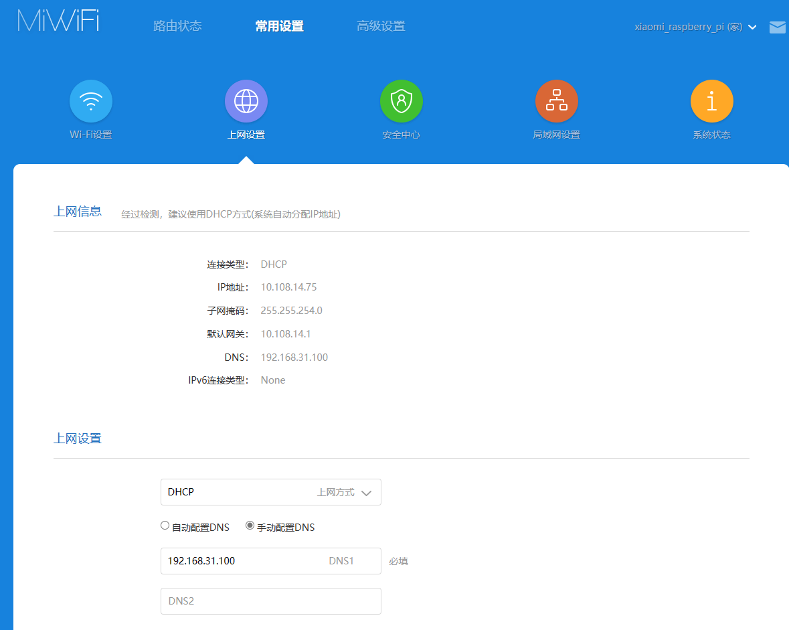
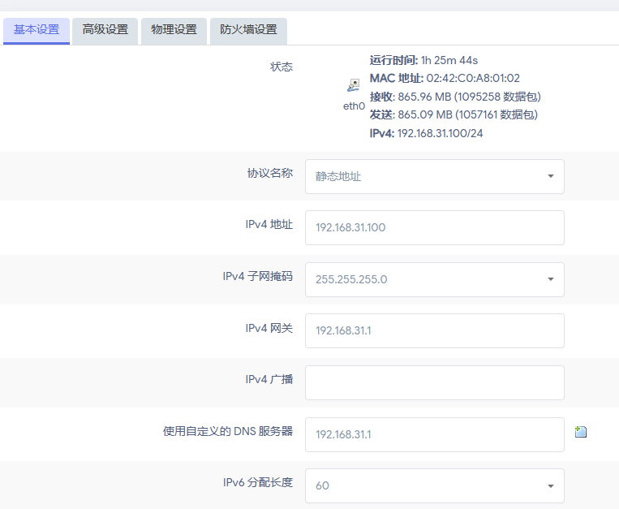

# 旁路由配置

主路由关闭DHCP然后旁路由的网关和DNS指向主路由然后旁路由开启DHCP和强制DHCP，设备重新连接主路由，看到主路由网关为旁路由，配置成功

## 2023/9/18 家用路由器配置更新

上网设置中wan口使用DHCP由上层nat给主路由分配IP地址和网关，配置DNS为openwrt，关闭路由器的DHCP服务器

DHCP由旁路由负责，将旁路由的网关和DNS指向主路由作为出口，旁路由开启强制DHCP，由旁路由代理局域网的所有设备

